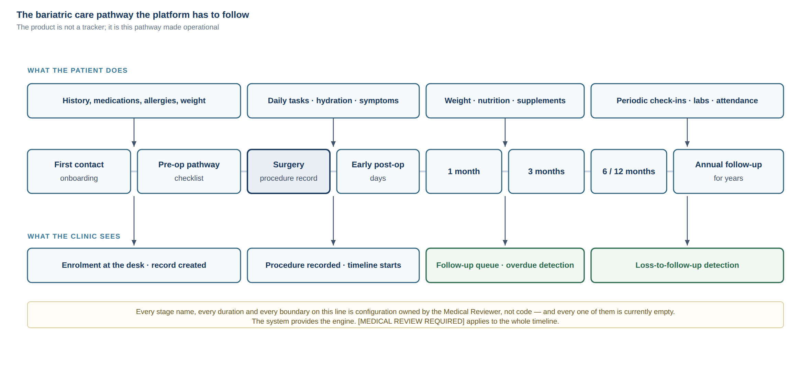

# Claude Code Project Readiness Report

**Project:** Bariatric Digital Care Platform
**Prepared for:** Ali — Product Owner, Medical Reviewer, Technical Operator
**Status:** Pre-approval. No code written. Nothing in this report is approved.
**Date:** 2026-09-16

---

## PART 1 — Understanding

### 1.1 What is actually being built

A **Digital Bariatric Care Pathway**: a system that follows one patient from first
consultation through years of post-operative follow-up, for a clinic seeing 200–500
patients a month.

The distinction that matters most, and that shapes every architectural decision below:

> This is not a tracking app that happens to be used by a clinic. It is a **clinical
> workflow system** that happens to have a patient-facing data-collection surface.

A weight tracker's unit of value is a logged weight. This product's unit of value is a
**resolved follow-up** — a patient who was drifting out of care, was detected, was
contacted, and came back. Everything else (weight, hydration, protein, supplements,
symptoms) is instrumentation that feeds that outcome.

If that framing is accepted, three consequences follow immediately:

1. **The dashboard is the product; the app is a sensor.** The commercial value lives in
   the surgeon's screen — the ranked, filtered, actionable list of who needs attention
   today. The patient app exists to keep that list accurate.
2. **Patient engagement is the single biggest product risk**, not a nice-to-have metric.
   Every downstream feature's value multiplies by the engagement rate. At 20% engagement,
   a beautifully engineered nutrition module is worth almost nothing.
3. **The system must produce value at zero patient app adoption.** If a nurse can enter
   a weight and the dashboard still surfaces overdue follow-ups, the clinic gets value on
   day one, and patient adoption becomes upside rather than a precondition. This is the
   most important design constraint I would add to the brief, and it is not in it.

### 1.2 The three hard problems

Most of this system is ordinary CRUD. Three parts are genuinely hard and deserve
disproportionate design attention, review and testing:

**(a) The pathway/protocol engine.** Clinical content must be *data*, not code — so the
surgeon can change the protocol without a developer. The hard part is not running the
engine; it is **versioning**. When the doctor changes the week-2 diet phase in March, a
patient who completed week 2 in January must still be interpretable under the protocol
that was actually in force for them. Get this wrong and the historical dataset becomes
scientifically and legally worthless. This is why protocol definitions must be
immutable-and-versioned, and every patient must be pinned to a protocol version.

**(b) Authorization.** Not "is the user logged in" but "may *this* actor see *this*
patient's row". Every list query, every file, every export, every AI retrieval call. One
missed check is a patient-data breach. The correct shape is a single policy layer of pure
functions used by every path with no privileged bypass — the pattern already proven in
`../student-os` (ADR-0003).

**(c) The alert engine.** This is the highest-risk component in the entire product, for
clinical, legal and reputational reasons simultaneously. The engineering is easy. The
danger is that a working alert engine creates a *false impression of monitoring*. A
patient who submits a symptom at 2 a.m. and receives a calm confirmation screen may
reasonably infer someone is watching. Nobody is. That gap — between what the software
implies and what the clinic actually staffs — is how this project hurts someone.

### 1.3 Safety position I am designing to

Derived from the handoff (§17, §32, §96, §97, §98) and stated here as engineering
constraints, not aspirations:

- **No autonomous diagnosis, treatment recommendation, medication change, or surgical
  advice.** Not by rules, not by AI.
- **Absence of an alert is never reassurance.** The app must never state or imply that a
  patient is fine. There is no "all clear" screen. This is a copy constraint enforced in
  design review.
- **Every symptom intake states, at the moment of submission, the expected response
  window and the emergency instruction.** "Reviewed during clinic hours. For severe
  symptoms, go to the nearest emergency department / call X." Anything less overpromises.
- **Alerts route to a human queue.** The rule decides *routing*, never *meaning*.
- **Clinical content is authored by the Medical Reviewer, versioned, and approved before
  it can be served.** No clinical string ships from a developer's keyboard.

### 1.4 What the clinic actually gets

Stated plainly, so we can test whether we delivered it:

- The surgeon opens one screen and sees who needs attention today, ranked, with a reason.
- Nobody disappears silently. A patient who misses a 6-month follow-up becomes visible.
- The doctor's protocol is configuration the doctor controls, not code a developer owns.
- Every clinically meaningful action has an auditable record of who did what, when.
- The patient has a simple, Arabic-first app that tells them what to do today.

---

## PART 2 — Assumptions

These are assumptions, not facts. Each one that is wrong changes the design. Correct any
that are wrong before approval.

### Users and context

| # | Assumption | If wrong, what changes |
| --- | --- | --- |
| A1 | Patients are predominantly in Iraq, Arabic-speaking, with mixed digital literacy. Arabic is the primary language, English secondary. | UX, content pipeline, RTL priority |
| A2 | Android dominates the patient base; iOS is a meaningful minority that still must be supported. | Release order, test-device matrix |
| A3 | Phone number — not email — is the natural patient identifier. Many patients have no email address they check. | Authentication design (major) |
| A4 | Some patients share a phone, or have a family member operate the app for them. | Account model, consent, future caregiver role |
| A5 | Mobile data is intermittent; patients are often on 3G/weak LTE. | Client caching, retry, offline tolerance |
| A6 | WhatsApp is the dominant communication channel culturally; the clinic already uses it informally. | Notification channel strategy (major) |
| A7 | Clinic staff = surgeon + 1–3 people (coordinator/nurse, dietitian, admin). Not a large team. | RBAC realism, workflow design |
| A8 | The clinic is **not** staffed 24/7 and will not become a monitoring service. | All alert/symptom copy and SLAs |

### Product and clinical

| # | Assumption | If wrong, what changes |
| --- | --- | --- |
| A9 | Greenfield. No existing EMR to integrate with; current records are paper or ad-hoc digital. | Migration scope, integration scope |
| A10 | No HL7/FHIR interoperability requirement at MVP, but the data model should not preclude it later. | Data model conventions |
| A11 | All clinical content (diet phases, red flags, lab schedules, supplement protocols, patient copy) is supplied and approved by the Medical Reviewer. **Nothing clinical is invented by AI.** | Non-negotiable |
| A12 | Version 1 serves one clinic and one surgeon, but must not foreclose multi-clinic SaaS. | Tenancy strategy |
| A13 | Payments, billing and subscriptions are out of scope for MVP and Phase 2. | Scope |
| A14 | The platform is not a regulated medical device in its launch jurisdiction under its launch feature set. **This is an assumption, not a legal finding.** | Everything. Needs legal review. |

### Engineering and operations

| # | Assumption | If wrong, what changes |
| --- | --- | --- |
| A15 | Ali operates cloud, deployments and service accounts, and is technical enough to run a CLI, read logs, and manage secrets. | Ops model, runbook depth |
| A16 | Budget is bootstrapped, not funded. Infrastructure choices are cost-sensitive. | Stack, hosting |
| A17 | Timeline is months, not weeks. A rushed MVP is more dangerous here than a late one. | Roadmap |
| A18 | No hard legal requirement (yet known) forcing data residency inside Iraq. **Assumption. Needs legal review.** | Hosting region, provider |
| A19 | `../student-os` in this workspace is a valid capability reference: the same Product Owner and the same AI workforce already shipped a modular-monolith TypeScript system with CI, integration tests, E2E journeys, RTL/a11y audits, backup-restore drills and App Store readiness documentation. | Confidence levels throughout this report |
| A20 | Two AI agents (Claude Code, Codex) plus Ali form the working team, with a part-time human engineer available. | Ways of working |
| A21 | Patient-facing content and notifications must never expose clinical detail on a lock screen. | Notification payload design |

### Assumptions I explicitly refuse to make

- That HIPAA, GDPR or any specific framework applies. Iraqi law governs; I do not know
  it. I will apply equivalent engineering practice as a **baseline**, and will not claim
  compliance with anything.
- That patients will engage because the app is good. They mostly will not, unless the
  clinic actively enrolls them face-to-face.
- That any clinical threshold, formula (%TWL, %EWL), phase duration, or symptom list is
  correct. All are `[MEDICAL REVIEW REQUIRED]`.

---

## PART 3 — Missing Decisions

Decisions I cannot make from engineering reasoning. Grouped by what they block. The
blocking ones are restated as direct questions in
[`06-OPEN-DECISIONS.md`](./06-OPEN-DECISIONS.md).

### Blocks architecture (needed before Milestone 1)

1. **Patient authentication method.** Phone+OTP is the natural fit for A3, but OTP in
   Iraq has real cost and deliverability problems. This decision has a cost tail and
   changes the identity module fundamentally.
2. **Is WhatsApp a supported channel?** It changes the entire notification architecture,
   adds a business verification process, and may be the difference between 30% and 80%
   reminder reach. This is the highest-leverage open decision in the project.
3. **Hosting provider and region**, which follows from the data-residency answer.
4. **Legal data controller identity** — the doctor personally, a clinic entity, or a
   company. This determines who signs provider contracts and owns the data.
5. **Tenancy posture for v1** — I have a recommendation (`clinic_id` present from day
   one, single-tenant deployment) but it needs confirmation because it has a small
   ongoing cost.

### Blocks scope (needed before Milestone 1 planning)

6. **Dashboard-first or app-first?** I recommend dashboard-first (see §1.1 and
   [`05-MVP-AND-ROADMAP.md`](./05-MVP-AND-ROADMAP.md)). This reverses the natural
   instinct and needs an explicit decision.
7. **Is in-app messaging in MVP?** The handoff leaves it open. I recommend no.
8. **Is there an existing patient database to migrate?** Changes Milestone 2 entirely.
9. **Pilot size and date.** How many patients, when, and who selects them.

### Blocks clinical work (needed before Milestone 6+, but start now — long lead time)

10. All items in [`09-CLINICAL-CONTENT-REQUESTS.md`](./09-CLINICAL-CONTENT-REQUESTS.md).
    These have the longest lead time of anything in the project and are the most likely
    critical-path bottleneck.

### Blocks launch (needed before Milestone 11, decide early anyway)

11. **Apple Developer account type** — individual vs. organization. Medical/health apps
    submitted under an individual account draw more scrutiny and the entity name appears
    publicly. Changing later is painful.
12. **Who is the legal reviewer**, and when they are engaged.
13. **Branding** — clinic name, logo, colours, app name, domain.

---

## PART 4 — Capability Matrix

See [`01-CAPABILITY-ASSESSMENT.md`](./01-CAPABILITY-ASSESSMENT.md) for sections A–D and
the full matrix.

## PART 5 — Risk Register

See [`02-RISK-REGISTER.md`](./02-RISK-REGISTER.md).

## PART 6 — Recommended Stack

See [`03-STACK-EVALUATION.md`](./03-STACK-EVALUATION.md).

## PART 7 — Architecture

See [`04-ARCHITECTURE-DRAFT.md`](./04-ARCHITECTURE-DRAFT.md).

## PART 8 — MVP Recommendation · PART 9 — Roadmap

See [`05-MVP-AND-ROADMAP.md`](./05-MVP-AND-ROADMAP.md).

## PART 10 — Human Intervention Points

See [`08-WAYS-OF-WORKING.md`](./08-WAYS-OF-WORKING.md).

## PART 11 — Cost Drivers

See [`07-COST-DRIVERS.md`](./07-COST-DRIVERS.md).

## PART 12 — Questions for Ali

See [`06-OPEN-DECISIONS.md`](./06-OPEN-DECISIONS.md).

---

## The ten direct answers

### 1. What proportion of this project can Claude Code actually execute?

Two numbers, because one number would be misleading.

**Of the code and technical artifacts: 75–85%.**
**Of the project as a whole: 40–50%.**

The gap between them is the honest answer. A software project of this type is roughly
half engineering artifacts and half things that are not artifacts at all: clinical
content, decisions, operations, validation, trust-building with staff, legal posture, and
launch. Claude Code is very strong at the first half and structurally incapable of the
second.

| Dimension | Claude Code share |
| --- | --- |
| Backend code, API, data model, migrations | 90% |
| Authorization logic and its tests | 85% (the 15% is adversarial human review) |
| Dashboard web app | 85% |
| Patient mobile app code | 80% (build/signing/store is not code) |
| Tests (unit, integration, authorization, E2E) | 90% |
| CI/CD configuration | 90% |
| Documentation, ADRs, runbooks | 95% |
| Infrastructure-as-code | 75% (writing it, not owning the accounts) |
| Clinical content | **0%** |
| Product decisions and prioritisation | **0%** |
| Legal, privacy, regulatory posture | **0%** |
| Production operation and incident response | 20% (writes the runbook, cannot be paged) |
| Store submission and release | 10% |
| Clinical validation and pilot | **0%** |

Treat the headline as ~80% of the typing and ~45% of the project.

### 2. What can Codex help with or review?

Codex is most valuable where an **independent** second opinion beats a larger volume of
first-opinion output. Concretely:

- **Adversarial review of authorization**, as a different model reading the policy layer
  cold and trying to find a path where `patient_id` is not constrained.
- **Test generation from contracts** — given the API contract and the policy functions,
  write the negative tests, not the happy path.
- **Security review of specific surfaces**: authentication, file access and signed URLs,
  file upload handling, rate limiting, input validation.
- **Medical rule test cases** — given an approved rule with a version and a threshold,
  enumerate boundary and off-by-one cases (at the threshold, one below, missing data,
  stale data, duplicate submissions).
- **Second opinion on data model** before migrations are written, when changing is cheap.
- **Dependency and license review.**
- **Reviewing my code when I wrote it, and vice versa** — with the rule that neither
  agent's output is accepted because the other agent approved it. Ali accepts.

Where Codex is *not* useful: as a parallel feature factory on the same surface. Two
agents implementing adjacent features in the same module produces merge chaos and
inconsistent conventions. One owner per feature, one reviewer per feature.

### 3. What must Ali do personally?

Nothing on this list can be delegated to any AI:

- **All clinical content and its approval.** Diet phases, durations, red-flag criteria,
  symptom lists, lab schedules, supplement protocols, medication rules, alert thresholds,
  and the exact Arabic wording of anything a patient reads that touches their health.
- **Product decisions**: scope, priority, what ships, what waits, what gets cut.
- **Acceptance.** Final accept/reject on every feature. Neither agent accepts its own or
  the other's work.
- **Cloud accounts, billing, secrets, service accounts, production credentials.**
- **Production deployment authorisation**, and the decision to put real patients on it.
- **The pilot**: selecting patients, enrolling them face-to-face, gathering feedback.
- **Clinic staff buy-in.** The coordinator and dietitian have to want to use this. That
  is a human relationship, and it is a genuine project risk if neglected.
- **Engaging the legal reviewer, the security reviewer, and the human developer.**
- **Being the escalation point** when an alert fires and someone must act.

### 4. What needs a human developer?

- **Apple Developer Program enrolment**, certificates, provisioning profiles, signing.
- **App Store and Google Play submission**, review responses, rejection appeals.
- **Final device testing on real hardware** — a range of actual Android phones including
  old and low-end ones, and real iPhones. Emulators do not surface the failures that
  matter (fonts, Arabic shaping, notification behaviour, background restrictions on
  Chinese-OEM Android skins, battery optimisation killing reminders).
- **Native module work** if it becomes necessary (health platform integrations,
  background tasks, push edge cases).
- **A release engineering pass** before first production launch — someone experienced
  looking at the whole deploy path and saying "yes" or "no".
- **Being on call.** An AI cannot be paged at 3 a.m.
- **Independent architecture review at Milestone 0 and Milestone 9.** Ideally 4–8 hours
  of a senior engineer's time, twice, from someone with no stake in the code being right.

### 5. What needs a security, legal or medical specialist?

**Security specialist** (one-off engagements, not full time):
- Penetration test before production launch, focused on broken access control and IDOR —
  the failure mode most likely here and the one automated tooling finds worst.
- Review of the authentication and session design before it is built, not after.
- Review of the file access and signed-URL design.
- Infrastructure review: network exposure, database reachability, secrets handling.

**Legal / privacy reviewer** (local to the launch jurisdiction):
- What law actually governs patient health data here, and what it requires.
- Whether this product is a regulated medical device under its launch feature set.
- Data controller identity, retention obligations, deletion rights, consent wording.
- Privacy policy, terms of service, medical disclaimer.
- Cross-border data transfer position if hosting is outside the country.
- Liability posture for the alert feature specifically.

**Medical specialist** — this is Ali, plus:
- A dietitian to validate the nutrition module against real practice.
- The clinic nurse/coordinator to validate that the follow-up workflow matches reality.
  Not optional: a dashboard that does not match how the clinic actually works will be
  abandoned regardless of code quality.
- Ideally a second bariatric surgeon reviewing the red-flag rules, because a single
  reviewer is a single point of clinical failure.

### 6. The five things most likely to kill this project

**1. Patient engagement collapses, and the data dries up.**
Patients install, use it for two weeks, and stop. The dashboard empties. The clinic
concludes it does not work. This is the most likely failure mode by a wide margin, and it
is a product problem that no amount of engineering fixes.
*Treatment:* design for value at zero patient adoption (staff-entered data), enroll
patients face-to-face at the clinic rather than by sending a link, keep the patient app
brutally small, and measure engagement from the first pilot patient.

**2. Clinical content never gets finished.**
Ali is the sole source of every diet phase, red flag, threshold and patient-facing
sentence, while also being the Product Owner, the Technical Operator, and a practising
surgeon. The engine gets built and sits empty. This is the most likely *schedule* killer.
*Treatment:* start clinical content now, in parallel with Milestone 0; treat it as the
critical path; ship with a deliberately small approved content set rather than waiting
for completeness.

**3. An access-control defect exposes patient data.**
One missing scope check in one list query. It is survivable technically and possibly not
survivable reputationally for a named surgeon in a local community.
*Treatment:* single policy layer, authorization tests as a first-class suite that runs on
every commit, adversarial review by the second agent, and a human penetration test before
launch. No exceptions for MVP speed.

**4. The alert system creates a duty of care nobody is staffed to meet.**
A patient reports a symptom, the app confirms receipt, and nobody looks until Sunday.
*Treatment:* explicit response-window copy at submission, no "all clear" state ever, a
named human owner for the queue with a defined review cadence, and a hard product rule
that a channel the clinic cannot staff does not ship.

**5. Single point of failure: Ali.**
Product owner, medical reviewer, technical operator, deployer, secret holder, escalation
point. Illness, travel, or a busy operating month stops the project entirely — and after
launch, stops patient care workflows.
*Treatment:* everything in the repository (§63), runbooks written for a stranger, a
second person with break-glass production access, and a part-time human engineer who
already has context before they are needed.

### 7. Can one person plus Claude Code and Codex launch a production-grade MVP?

**Yes — with conditions, and only for a deliberately narrow MVP.**

Precedent matters here: `../student-os` in this workspace was built this way and reached
a genuinely production-shaped state — real CI with integration and E2E gates, an
authorization layer with unit tests, backup and restore *drills*, a documented security
posture, App Store readiness audits. That is evidence, not optimism.

But that project's own audit documents also record what this model gets wrong: a CI
workflow that sat in the wrong directory so **phases 0 through 5 all merged with no CI
running at all**, and a production outage from a packaging failure that every green check
had missed. Both are the same failure: *the checks were not testing the thing that
actually ships.* That is the characteristic failure mode of AI-led development, and it is
worth more than any general warning about AI code quality.

The conditions I would not compromise on:

1. **Authorization is never shortcut for speed.** It is the one thing that cannot be
   fixed after a breach.
2. **CI is real, runs on every commit, and is verified to actually be running.** A green
   check that tests nothing is worse than no check.
3. **The pipeline tests the deployed artifact**, not the source tree.
4. **A tested restore, before real patient data exists.** A backup that has never been
   restored is a file, not a backup.
5. **No clinical content invented by AI. Ever.** Every clinical string traceable to an
   approved, versioned source.
6. **One feature at a time, through the full gate:** acceptance criteria → plan →
   implementation → tests → review by the other agent → demo → Ali approves.
7. **A human security review and a human release review before real patients.** Two
   one-off engagements. This is the cheapest insurance in the project.
8. **Staging is real and patients are never the test environment.**
9. **A pilot of 10–20 patients before the full panel**, with the explicit expectation of
   finding workflow problems, not bugs.
10. **Scope discipline.** The realistic failure is not bad code, it is a half-finished
    product with thirty features at 70%.

If any of 1, 4, 5 or 7 is dropped to save time, my answer changes to no.

### 8. Where is 100% reliance on AI dangerous?

- **Clinical content and rules.** An AI producing a plausible-sounding post-op diet
  progression is the single most dangerous thing that could happen in this project,
  precisely because it would look right.
- **Authorization.** I will write correct-looking policy code and correct-looking tests
  for it. Tests written by the same author as the code share the author's blind spots.
- **Anything where "it compiles and the tests pass" is mistaken for "it works."** See the
  CI and packaging failures cited above.
- **Production operations and incident response.** I cannot be paged, cannot notice a
  gradual degradation, cannot judge whether to roll back at 2 a.m.
- **Legal and regulatory judgement.** I will produce confident, fluent, and possibly
  wrong statements about Iraqi law. Treat any such statement from me as unreliable.
- **Knowing whether the clinic will actually use it.** I cannot observe the clinic.
- **Patient-facing tone in Arabic.** I can write fluent Arabic; I cannot judge whether a
  sentence lands correctly for a 55-year-old patient in Baghdad. That needs a human ear.
- **Judging clinical significance.** I can tell you a weight dropped 12%. I cannot tell
  you whether that matters.

### 9. Where does AI give the biggest speed and cost advantage?

- **Schema, migrations, contracts and API layer.** Mechanical, high-volume, rule-driven.
- **Test suites**, especially the tedious authorization matrix (every role × every
  resource × every operation) that a human team writes badly because it is boring.
- **Two client surfaces from one contract** — dashboard and mobile staying in sync.
- **Arabic/English bilingual UI with RTL**, done from the start instead of retrofitted.
- **Documentation, ADRs, runbooks** — normally the first thing a small team drops, and
  the thing this project most needs (§63).
- **CI/CD configuration and infrastructure-as-code.**
- **Refactoring under test.** Large mechanical changes that a human team avoids.
- **Exploring a design in prose before building it** — which is exactly what this
  document is, and it cost hours instead of a week of meetings.

Realistically this is the difference between a 4–6 person team and a 1 person + 2 agents
+ part-time specialist team, for the *construction* phase. It does not compress the
clinical content phase, the pilot, or the launch.

### 10. The cheapest realistic team that can still launch professionally

| Role | Who | Commitment | Non-negotiable? |
| --- | --- | --- | --- |
| Product Owner + Medical Reviewer | Ali | Significant and sustained | Yes |
| Technical Operator (cloud, secrets, deploys) | Ali | Ongoing | Yes |
| Primary implementer | Claude Code | Per milestone | — |
| Independent reviewer / test author | Codex | Per milestone | Yes (some second reviewer) |
| Senior engineer, retained | Human, part-time | ~4–8 hrs/week, plus 2 deep reviews at M0 and M9 | **Yes** |
| Security review + penetration test | Human, one-off | ~3–5 days before launch | **Yes** |
| Legal / privacy review | Human, one-off + annual | ~2–3 days | **Yes** |
| iOS release engineer | Human, one-off | ~5–10 days at launch | Yes |
| Clinic coordinator / nurse | Existing clinic staff | A few hours/week as pilot user and workflow validator | **Yes** |
| Dietitian | Existing clinic staff | A few hours for nutrition module validation | Yes |
| Arabic UX / copy review | Human, one-off | 2–3 days | Recommended |
| Second bariatric surgeon (rule review) | Human, one-off | 1–2 days | Recommended |

That is **one full-time person, two AI agents, one part-time engineer, and roughly four
short specialist engagements.** It is genuinely much cheaper than the 5–7 person team this
scope would normally imply — but note that every entry marked non-negotiable is a human,
and three of them are humans doing things no AI can do at any budget.

The retained part-time senior engineer is the line item most likely to be cut and the one
I would argue hardest to keep. Their value is not code. It is that somebody who is not
invested in the code being right looks at it, and that somebody other than Ali can be
reached when production breaks.
