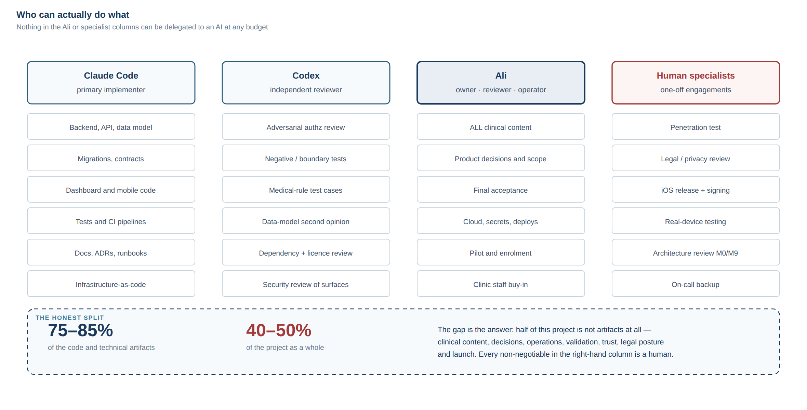

# 01 — Capability Assessment

Sections A–D of the Readiness Report, plus the capability matrix (PART 4).

Capability claims here are calibrated against `../../student-os` in this workspace —
a system of comparable complexity built by the same Product Owner with the same AI
workforce. Where I claim "I can do this", that repository generally contains evidence.
Where it does not, the claim is marked as untested.

---

## A. What I can build independently

"Independently" means: I can produce it, test it, and hand it over without needing a
decision or a credential from anyone. It does **not** mean nobody should review it.

### A1 — Backend API and domain logic

**What:** A modular monolith exposing a versioned REST API — patient records, surgery
records, measurements, appointments, tasks, nutrition entries, supplements, medications,
labs, symptoms, alerts, documents, content, notifications, audit, admin configuration.

**Technology:** TypeScript on Node, Fastify, Zod schemas shared between server and
clients as a contracts package, PostgreSQL accessed through parameterised SQL with
file-based migrations.

**To what level:** Production. Request validation on every endpoint, a consistent error
envelope, structured logging with redaction, health/readiness endpoints, rate limiting on
credential paths, graceful shutdown, transactional writes with a domain-event outbox.

**How I test it:** Unit tests over pure domain functions; integration tests against a
real PostgreSQL in CI (not a mock, not SQLite); a migrations-from-empty assertion that
fails the build if the schema cannot be rebuilt from nothing; a smoke suite driving every
module over real HTTP.

**Risks:** I write plausible code faster than anyone can review it. The specific danger
is not a syntax error, it is a *subtly wrong domain rule* that passes tests I also wrote.
Mitigation: acceptance criteria written and approved before implementation, and review by
the second agent against the criteria rather than against the code.

### A2 — Database design and migrations

**What:** Normalised relational schema, foreign keys, check constraints, indexes,
forward-only numbered SQL migrations, seed and demo-data scripts.

**To what level:** Production, with these properties designed in from the first
migration: `clinic_id` on every tenant-scoped table; `created_at`/`updated_at` as
timestamptz; soft-delete where clinical retention requires it; append-only history for
clinically significant records; data-source attribution on every measurement; protocol
version pinning on every pathway assignment.

**How I test it:** Migrations applied from an empty database in CI with an assertion that
every file on disk corresponds to an applied row; integration tests exercising the
constraints; explicit tests that a query cannot cross a `clinic_id` boundary.

**Risks:** Schema mistakes are the most expensive to correct once real patient data
exists. This is why I want a second opinion on the data model *before* migrations are
written — the cheapest possible moment.

### A3 — Authorization layer

**What:** Roles and permissions as data; a single policy module of pure, synchronous
functions over a fully resolved actor; scope-pushing into SQL `WHERE` clauses for list
queries rather than fetch-then-filter.

**To what level:** Production, and this is the component I would build most carefully in
the whole system. The pattern is proven in `student-os` ADR-0003.

**How I test it:** An exhaustive authorization matrix — every role × every resource ×
every operation × (own / same clinic / other clinic) — as fast unit tests over pure
functions, plus integration tests asserting that a cross-patient request returns the same
response shape as a not-found, leaking nothing.

**Risks:** Highest-consequence component in the system. My tests share my blind spots.
This needs adversarial review by the second agent and a human penetration test. I would
not accept my own authorization work as sufficient.

### A4 — Authentication and session handling

**What:** Credential handling with a standard memory-hard hash (Argon2id or scrypt — not
invented, not rolled by hand), short-lived access tokens with rotating refresh tokens,
token revocation, rate limiting and lockout on credential and OTP paths, secure storage on
the device, password/OTP reset flows with single-use, expiring, hashed tokens.

**To what level:** Production for the mechanism. The *method* (OTP vs password vs magic
link) is a decision I cannot make alone — see section B.

**How I test it:** Integration tests for the full lifecycle including expiry, reuse,
revocation and rate limiting; explicit tests that tokens are invalidated on password
change and on logout; tests that error responses do not distinguish "no such user" from
"wrong password".

**Risks:** I can implement the mechanism correctly and still have the *design* be wrong
for this user base. And OTP is a cost and deliverability problem before it is a code
problem. Design review before implementation, by a human.

### A5 — Clinical dashboard (web)

**What:** Role-aware dashboard — the actionable work queue, patient search with
server-side pagination, patient profile with longitudinal timeline, data entry on behalf
of patients, alert queue with acknowledgement, appointment management, protocol
configuration screens, admin/user management.

**Technology:** *(Superseded — this described Next.js with server-side data fetching. The
dashboard is now a **Vite + React static SPA served by the Fastify process at the same
origin**; see doc 11 §2.4. The capability claim is unchanged; the technology is not.)*
TypeScript, a
mature accessible component library rather than hand-rolled widgets, charting for weight
and lab trends.

**To what level:** Production, including loading and error states, empty states, RTL and
Arabic/English, keyboard navigation, and server-side pagination everywhere.

**How I test it:** Component tests for logic-bearing pieces; E2E browser journeys for the
critical paths (find patient → view timeline → record weight → acknowledge alert); an
RTL/layout audit in both languages at multiple viewports; an accessibility audit. All of
these patterns exist and run in `student-os` CI today.

**Risks:** I cannot judge whether the dashboard matches how the clinic actually works.
That requires the coordinator using it on real cases and telling us it is wrong.

### A6 — Patient mobile app

**What:** Expo/React Native app — onboarding, home screen with today's tasks, weight
entry, hydration and nutrition logging, supplement and medication reminders, symptom
check-in, appointments, educational content, notification preferences, account deletion.

**To what level:** Production-quality code, Arabic-first with RTL, large touch targets,
low-literacy-friendly flows, tolerant of weak connectivity (optimistic local writes with
retry and clear pending state), running on both platforms.

**How I test it:** Unit tests for client logic; the web export driven in a real browser
through Playwright for the full journey in both languages; an accessibility audit;
screenshot artifacts kept for visual review. `student-os` runs exactly this shape of
suite, including a preview build with an in-memory transport so UI gates cannot go red
because a server was slow.

**Risks and honest limits:** I cannot run the app on a real iPhone or a real low-end
Android phone. Browser-driven testing of a React Native Web export is a genuine proxy for
layout and flow, and a poor proxy for push notifications, background behaviour, OEM
battery optimisation, font shaping on old Android, and camera/photo permissions. Real
device testing is a human task (section C).

### A7 — Protocol / pathway engine

**What:** The engine that resolves *(patient, procedure, days since surgery, protocol
version) → current stage → tasks, content, required check-ins*. Definitions stored as
versioned data; patients pinned to the version in force when they were enrolled.

**To what level:** Production for the mechanism. **Zero** for the content — every stage
name, duration, task and instruction comes from the Medical Reviewer.

**How I test it:** Table-driven unit tests over the resolver, including boundaries (day
0, day before transition, day of transition, far future), missing surgery date, revised
surgery date, protocol version changes mid-journey, and patients enrolled retrospectively.

**Risks:** The temptation to hard-code "reasonable" defaults so the engine can be
demonstrated. I will not do that. Empty is the correct state until content is approved.

### A8 — Alert rule engine (mechanism only)

**What:** Declarative, versioned rules evaluated on domain events and on scheduled
sweeps, producing alerts with full provenance: rule id, rule version, triggering data
snapshot, triggered_at, severity, assigned queue, acknowledged_by, acknowledged_at,
action_taken, closed_at.

**To what level:** Production for the mechanism. Rules themselves are
`[MEDICAL REVIEW REQUIRED]` without exception.

**How I test it:** Every approved rule ships with its own test-case table supplied
alongside the rule (at threshold, below, above, missing data, stale data, duplicate
submission, patient out of scope). A rule without test cases does not ship.

**Risks:** This is the component whose *correct operation* can still cause harm, by
implying monitoring that is not staffed. The engineering controls are in the product copy
and queue-ownership design, not in the engine.

### A9 — Notifications

**What:** A notification service with per-user, per-category preferences, quiet hours,
templated bilingual content, delivery attempt records, and a generic-payload rule so no
clinical detail appears on a lock screen.

**To what level:** Production for push (Expo push / FCM / APNs) and email. SMS and
WhatsApp are integrations I can write but cannot provision (section C).

**How I test it:** Unit tests over scheduling and preference resolution; integration tests
over the outbox and delivery records; a test asserting no notification payload contains
clinical terms.

**Risks:** Push delivery is best-effort and silently unreliable on some Android OEMs. The
system must never treat "notification sent" as "patient informed" — so delivery state is
recorded, and a missed task is detected by the absence of the *action*, not the absence of
a notification failure.

### A10 — File and document handling

**What:** Object storage with authorization checked before any URL is minted, short-lived
*(Superseded — v1 mints no signed URLs. The API proxies every document byte so the policy
call runs and an audit row is written; see ADR-0004 and doc 11 §3.6. Signed URLs remain
architecturally permitted for a later phase.)* content-type and magic-byte
validation, size limits, image metadata stripping, non-sequential storage keys, and an
audit record on every document access.

**To what level:** Production. This pattern exists and is documented in `student-os`.

**Risks:** Malware scanning of uploads needs an external service (section C). Without it,
the mitigation is to never serve an uploaded file back as a renderable document to another
user without validation — a design constraint, not a code fix.

### A11 — Audit logging

**What:** An append-only audit event stream — actor, action, resource type, resource id,
timestamp, request correlation id, outcome — covering login, patient record viewed, data
edited, medication updated, alert acknowledged, document opened, clinical note modified,
export performed, permission changed.

**To what level:** Production, with the deliberate constraint that audit records carry
identifiers rather than clinical values, so the audit trail does not itself become a
second copy of the medical record.

### A12 — Testing, CI/CD, observability, documentation

**What:** Full pipeline — lint, typecheck, unit, integration against real PostgreSQL,
authorization suite, migrations-from-empty, build, E2E journeys, RTL and accessibility
audits, dependency audit, secret scanning, and a deployment-contract gate that exercises
the *packaged artifact* rather than the source tree. Structured logging with redaction,
error tracking integration, uptime checks, health endpoints. Backup, restore, and a
restore *drill* script. All docs and ADRs.

**Evidence:** Nearly all of this exists in `student-os` today.

**Risks:** I can write a pipeline that does not actually run. `student-os` merged phases 0
through 5 with a workflow in the wrong directory and zero checks executing. The mitigation
is explicit: after CI is configured, verify a deliberately failing commit is *rejected*.

---

## B. What I can build, but need input from Ali

Technically straightforward; blocked on a decision or on content.

| # | What | What I need from you | Why I cannot decide it |
| --- | --- | --- | --- |
| B1 | Diet phase definitions and the phase engine's content | Phase names, order, durations by procedure, what is allowed/avoided, transition criteria | `[MEDICAL REVIEW REQUIRED]` — inventing a post-op diet progression is the single most dangerous thing I could do |
| B2 | Red-flag rules | Which findings route to which queue, at what threshold, with what urgency | `[MEDICAL REVIEW REQUIRED]` |
| B3 | Symptom list and intake wording | The symptoms you want captured, their answer scales, exact Arabic wording | `[MEDICAL REVIEW REQUIRED]` |
| B4 | Alert severity levels and routing | Level names, definitions, which role owns each queue, expected response window | Clinical + staffing reality |
| B5 | Follow-up schedule | Intervals by procedure, what "overdue" means, when a patient is "lost" | `[MEDICAL REVIEW REQUIRED]` |
| B6 | Pre-op checklist template | Investigations, labs, imaging, consultations, education, consent steps | `[MEDICAL REVIEW REQUIRED]` |
| B7 | Lab panels and schedules | Which tests, at which intervals, units, reference ranges | `[MEDICAL REVIEW REQUIRED]` |
| B8 | Supplement protocol | Which supplements, doses, schedules, by procedure and phase | `[MEDICAL REVIEW REQUIRED]` |
| B9 | Nutrition targets | Protein/fluid targets by phase and patient factors; whether calories are tracked at all | `[MEDICAL REVIEW REQUIRED]` |
| B10 | Weight-loss metrics | Whether %TWL / %EWL are used, which formula, which ideal-weight basis | `[MEDICAL REVIEW REQUIRED]` — competing formulas exist and the choice is clinical |
| B11 | Procedure list | Which procedures the clinic performs, with any protocol differences | Clinical |
| B12 | Intake fields | Which history, comorbidity and lifestyle fields are captured, and which are required | `[MEDICAL REVIEW REQUIRED]` |
| B13 | All patient-facing copy | Every sentence a patient reads about their health, in Arabic | Clinical + tone |
| B14 | Notification wording and timing | Message text, send times, frequency ceilings, quiet hours | Product + clinical |
| B15 | Authentication method | OTP / password / hybrid, and acceptance of the cost | Cost and user-behaviour judgement |
| B16 | Channel strategy | Whether WhatsApp/SMS are in scope | Cost, business verification, biggest single lever on reach |
| B17 | Role definitions | What each role may actually see and do in *your* clinic | Organisational |
| B18 | Dashboard priorities | Which queues appear first on the surgeon's screen | Product |
| B19 | Retention and deletion policy | How long data is kept; what deletion means for clinical records | Legal + clinical |
| B20 | Branding | Name, logo, colours, domain, app name | Business |
| B21 | Educational content | Articles, videos, instructions, FAQs | `[MEDICAL REVIEW REQUIRED]` |
| B22 | Medication rules | What the module may and may not do; provider-only boundaries | `[MEDICAL REVIEW REQUIRED]` |

**The pattern:** I build the *engine*; you supply the *medicine*. Every row above is an
engine I can build this month and content only you can approve.

---

## C. What I cannot safely complete alone

Stated without hedging. These are not "harder for me" — they are outside what I can do.

### C1 — Things requiring a human being

| Item | Why |
| --- | --- |
| Testing on real devices | I have no phone. Push behaviour, background restrictions, OEM battery killers, Arabic font shaping on old Android, camera permissions — none are observable from a browser |
| App Store / Play submission | Requires an account holder, agreements, signing identity, and responses to human reviewers |
| Certificates, provisioning, signing | Requires account access and a person legally accepting terms |
| Production incident response | I cannot be paged, cannot watch a gradient, cannot decide to roll back at 2 a.m. |
| Penetration testing | Automated checks find a fraction of broken access control. A human adversary is a different activity |
| Clinical validation | Requires clinical judgement and responsibility for patients |
| Pilot and user research | Requires observing real people using it |
| Staff training and adoption | A human relationship |
| Being legally responsible for anything | I cannot hold responsibility |

### C2 — Things requiring accounts and credentials I must never hold

Apple Developer Program; Google Play Console; cloud provider account and billing;
production database credentials; domain registration and DNS; SMS gateway contracts;
WhatsApp Business API approval; push notification credentials (APNs keys, FCM);
error-tracking and monitoring accounts; email sending domain verification; any payment
processing.

I can write every line of configuration and every runbook step for all of these. I must
not hold the credentials, and I should not be given them.

### C3 — Things requiring professional judgement I cannot provide

Legal review of Iraqi health-data law; the determination of whether this is a regulated
medical device; privacy policy and terms with legal standing; liability posture for the
alert feature; any compliance claim; clinical sign-off on any rule or content; the
decision to put real patients on the system.

### C4 — Things I can do but should not do unreviewed

Authorization logic (needs adversarial review + pen test); authentication design (needs
human design review before implementation); anything touching file access; the alert
engine's routing behaviour; the first production deployment; any migration that rewrites
existing patient data.

### C5 — My honest self-assessment as a worker

Failure modes to plan around rather than hope against:

1. **I am fluent when I am wrong.** My confident tone does not vary with my accuracy.
   This is most dangerous on legal and clinical questions.
2. **I test what I built, for what I thought of.** My tests inherit my blind spots.
3. **I mistake "checks are green" for "it works."** The `student-os` history in this
   workspace has two documented instances: a CI workflow that never ran for six phases,
   and a production 502 that every green check missed because nothing tested the packaged
   artifact.
4. **I do not know what I was not told.** If the clinic has a workflow nobody described
   to me, I will build something that does not fit and it will look finished.
5. **Context is finite.** On a long project I will forget decisions unless they are in
   the repository. This is exactly why §63 of the handoff is correct and non-negotiable.
6. **I will drift toward more code.** Left unchecked I will produce more surface area than
   one person can maintain. Scope discipline has to come from you.

---

## D. External dependencies

| Item | Can Claude do it? | Needs Ali? | Needs human specialist? | Why |
| --- | --- | --- | --- | --- |
| Backend API, services, domain logic | ✅ Yes | Acceptance | Review | Ordinary engineering |
| Database schema and migrations | ✅ Yes | Acceptance | Second opinion pre-migration | Expensive to change later |
| Authorization layer | ✅ Build | Acceptance | ✅ Pen test + review | Highest-consequence component |
| Authentication implementation | ✅ Build | ✅ Method decision | ✅ Design review | Cost and behaviour judgement |
| Clinical dashboard | ✅ Yes | ✅ Priorities | Clinic staff validation | Must match real workflow |
| Patient mobile app (code) | ✅ Yes | ✅ Copy + scope | ✅ Device testing | No physical device |
| Mobile build, signing, release | ⚠️ Config only | ✅ Accounts | ✅ Yes | Legal identity + accounts |
| App Store / Play submission | ❌ No | ✅ Yes | ✅ Yes | Human reviewers, agreements |
| Protocol engine (mechanism) | ✅ Yes | Acceptance | — | Pure engineering |
| Protocol content | ❌ **Never** | ✅ **Yes** | Dietitian / 2nd surgeon | `[MEDICAL REVIEW REQUIRED]` |
| Red-flag rules (mechanism) | ✅ Yes | Acceptance | — | Pure engineering |
| Red-flag rules (content) | ❌ **Never** | ✅ **Yes** | ✅ 2nd surgeon | `[MEDICAL REVIEW REQUIRED]` |
| Push notifications (code) | ✅ Yes | ✅ Credentials | — | Needs APNs/FCM accounts |
| SMS / OTP delivery | ⚠️ Integration only | ✅ Contract + billing | Possibly | Local gateway, cost, deliverability |
| WhatsApp Business API | ⚠️ Integration only | ✅ Business verification | Possibly | Meta approval process |
| Email delivery | ⚠️ Integration only | ✅ Domain + DNS | — | Needs domain control |
| Object storage | ✅ Yes | ✅ Account | — | Needs cloud account |
| Malware scanning of uploads | ⚠️ Integration only | ✅ Service account | — | External service |
| Infrastructure-as-code | ✅ Write | ✅ Apply | Review at M0/M9 | Cannot hold credentials |
| Hosting provisioning | ⚠️ Scripted | ✅ Yes | — | Account + billing |
| CI/CD pipeline | ✅ Yes | ✅ Repo secrets | — | Secrets are yours |
| Backup scripts and restore drill | ✅ Yes | ✅ Run in production | — | Must be run for real |
| Monitoring / error tracking | ✅ Integrate | ✅ Account | — | Account + PHI scrubbing config |
| Test suites | ✅ Yes | — | Codex adversarial review | Shared blind spots |
| Penetration test | ❌ No | ✅ Engage | ✅ **Yes** | Different activity entirely |
| Documentation and ADRs | ✅ Yes | Approval | — | — |
| Privacy policy / terms | ⚠️ Draft only | ✅ Yes | ✅ **Yes** | Needs legal standing |
| Legal / regulatory determination | ❌ **No** | ✅ Engage | ✅ **Yes** | I will be confidently wrong |
| Data residency decision | ❌ No | ✅ Yes | ✅ Legal input | Legal question |
| Arabic patient-facing copy | ⚠️ Draft | ✅ **Approve** | Native UX reviewer | Tone and clinical safety |
| Clinical validation / pilot | ❌ No | ✅ **Yes** | ✅ Clinic staff | Requires real patients |
| Staff training and adoption | ❌ No | ✅ Yes | — | Human relationship |
| Production deploy authorisation | ❌ No | ✅ **Yes** | Release review at launch | Responsibility |
| On-call / incident response | ❌ No | ✅ Yes | ✅ Yes | Cannot be paged |

**Legend:** ✅ can/must · ⚠️ partial — can write it, cannot provision or own it · ❌ cannot
