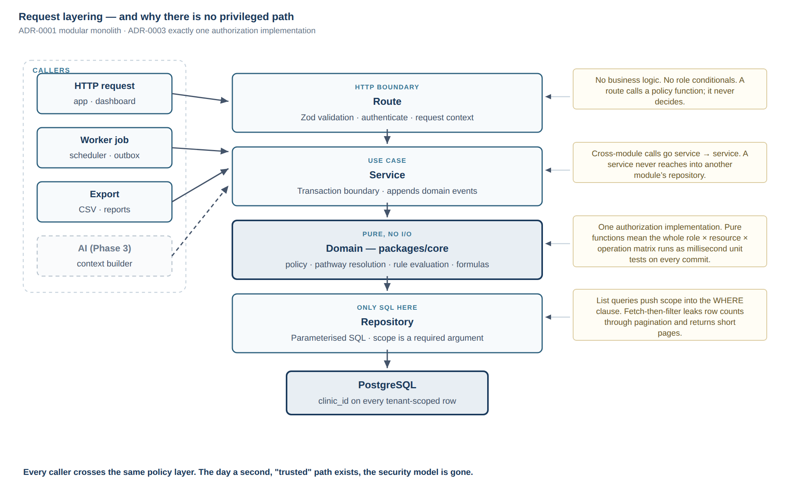
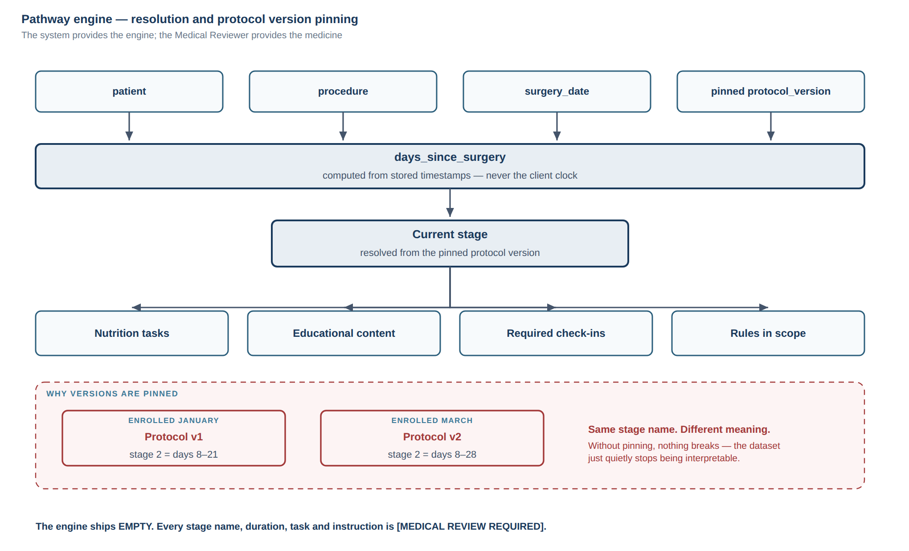
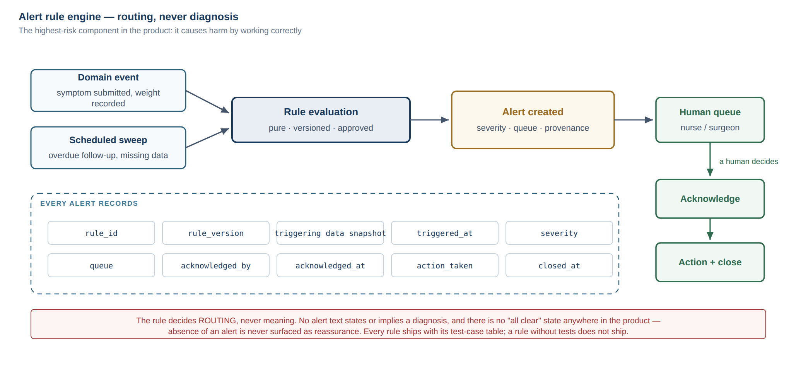
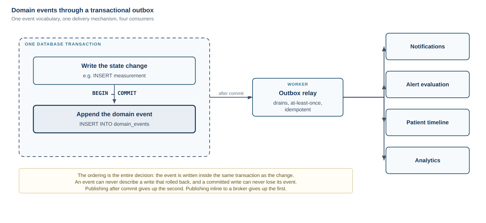
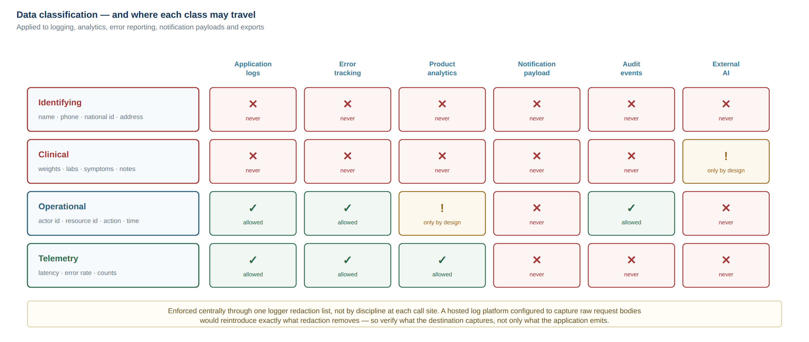

# 04 — Architecture (PART 7) — DRAFT, NOT APPROVED

High-level architecture proposal. Assumes Option A from
[`03-STACK-EVALUATION.md`](./03-STACK-EVALUATION.md). Nothing here is settled; this is
the shape I would defend in review.

---

## 1. System context

```
   ┌──────────────┐   ┌──────────────────┐   ┌──────────────────┐
   │ Patient app  │   │ Clinical         │   │ Admin / config   │
   │ Expo (iOS +  │   │ dashboard        │   │ (same dashboard, │
   │ Android)     │   │ Next.js          │   │  gated by role)  │
   └──────┬───────┘   └────────┬─────────┘   └────────┬─────────┘
          │                    │                      │
          └──────────── HTTPS / REST + Zod ───────────┘
                               │
                    ┌──────────▼───────────┐
                    │   API  (Fastify)     │
                    │   modular monolith   │
                    └──────────┬───────────┘
                               │
          ┌────────────────────┼────────────────────┐
          │                    │                    │
   ┌──────▼──────┐   ┌─────────▼────────┐  ┌────────▼────────┐
   │ PostgreSQL  │   │ Object storage   │  │ Worker process  │
   │ (managed)   │   │ (S3-compatible)  │  │ scheduler +     │
   └─────────────┘   └──────────────────┘  │ outbox relay    │
                                           └────────┬────────┘
                                                    │
                          ┌─────────────────────────┼──────────────┐
                          │                         │              │
                   ┌──────▼──────┐          ┌───────▼─────┐  ┌─────▼──────┐
                   │ Push        │          │ SMS / What- │  │ Email      │
                   │ (APNs/FCM)  │          │ sApp  [TBD] │  │            │
                   └─────────────┘          └─────────────┘  └────────────┘
```

Both clients speak to the same API. Neither touches the database. No client holds a
privileged credential.

## 2. Layering inside the API



```
HTTP route        validation (Zod), auth, request context — no business logic
    ↓
Service           use case, transaction boundary, emits domain events
    ↓
Domain (core)     pure functions: policy, pathway resolution, rule evaluation, formulas
    ↓
Repository        parameterised SQL. Only layer that touches the database
```

Rules that make this hold rather than decay:

- Cross-module calls go through **services**, never another module's repository.
- Domain logic is **pure and dependency-free**, so it is testable in milliseconds and
  reusable by API, worker, exports and any future AI path.
- Routes contain no conditionals about roles — they call policy functions.
- A repository never calls a service.

## 3. Modules

| Module | Responsibility |
| --- | --- |
| `identity` | Accounts, credentials, sessions, tokens, device registration |
| `authz` | Roles, permissions, actor resolution (policy itself lives in `core`) |
| `clinic` | Clinic record, staff, branding config, feature flags, settings |
| `patients` | Demographics, medical history, comorbidities, allergies, enrolment |
| `surgery` | Procedure records, dates, surgeon, facility, operative notes |
| `pathway` | Protocol definitions, versions, stages, assignment, resolution |
| `tasks` | Task instances generated from pathway stages, completion |
| `measurements` | Weight, BMI, body measurements, source attribution |
| `nutrition` | Meals, protein, fluids, supplements, adherence |
| `medications` | Medication list, schedules, adherence |
| `labs` | Panels, results, units, reference ranges, trends |
| `symptoms` | Structured check-ins, submissions |
| `alerts` | Rule engine, alert lifecycle, queues, acknowledgement, audit |
| `appointments` | Scheduling, status, reminders, overdue detection |
| `followup` | Loss-to-follow-up detection, the work queues |
| `documents` | Uploads, signed URLs, access audit |
| `content` | Educational content, versioning, targeting by procedure/stage |
| `notifications` | Preferences, templates, dispatch, delivery records |
| `audit` | Append-only audit event stream |
| `analytics` | Descriptive aggregates for the clinic |
| `admin` | Configuration surfaces, user management |

Each module: `routes / service / repository / <module>.policy usage / tests`.

## 4. Authorization

The single most important design in the system.

```ts
// packages/core/policy — pure, synchronous, dependency-free
canViewPatient(actor, patient): boolean
canEditMeasurement(actor, measurement): boolean
patientScopesFor(actor): Scope   // pushed into SQL WHERE, never post-filtered
```

- The `Actor` is resolved **once per request**: user, roles, clinic, assignments,
  and — for a patient — their own patient id.
- **List queries push scope into SQL.** Fetch-then-filter leaks row counts through
  pagination and returns short pages.
- **There is no privileged path.** Exports, analytics, notifications and any future AI
  retrieval call the same functions. The day a second "trusted" path exists, the security
  model is gone.
- Roles and permissions are **data**, not `if (role === 'doctor')` scattered through the
  codebase (§43).

Proposed roles: `patient`, `surgeon`, `dietitian`, `nurse_coordinator`, `clinic_admin`,
`super_admin`. Permissions are granular and assigned to roles, so a new role is
configuration rather than a code change. `[DECISION REQUIRED]` — the exact permission set
per role is an organisational decision (B17).

## 5. Tenancy

- `clinic_id` on every tenant-scoped table **from the first migration**. Cheap now,
  effectively impossible to retrofit later.
- Every query constrained by the actor's clinic, enforced in the policy layer.
- **One deployment, one clinic, for v1.** No tenant routing, no per-tenant provisioning,
  no clinic configuration portal. Those are Phase 3.
- A recurring test asserts no query returns rows across clinics.

This is the balance §39 asks for: the expensive-to-retrofit part now, the operationally
complex part later.

## 6. The pathway engine



```
patient + procedure + surgery_date + protocol_version
                    ↓
        days_since_surgery  (computed from stored timestamps, never client clock)
                    ↓
        current stage   (from the pinned protocol version)
                    ↓
   ┌────────────┬───────────────┬──────────────┬───────────────┐
   │ tasks      │ content       │ check-ins    │ rules in scope│
   └────────────┴───────────────┴──────────────┴───────────────┘
```

Design constraints:

- Protocol definitions are **immutable once activated**. Changes create a new version.
- Every patient is **pinned** to the version in force at enrolment, and migrating a
  patient to a newer version is an explicit, audited clinical action.
- Every generated task and every adherence record carries the protocol version used.
- The engine ships **empty**. No default stages, no default durations, no placeholder
  content. `[MEDICAL REVIEW REQUIRED]` for every value.

## 7. Alert rule engine



```
domain event  ──┐
                ├──▶ rule evaluation (pure) ──▶ alert ──▶ queue ──▶ human
scheduled sweep ┘         (versioned)                              decides
```

Every alert records: `rule_id`, `rule_version`, triggering data snapshot, `triggered_at`,
severity, queue, `acknowledged_by`, `acknowledged_at`, `action_taken`, `closed_at` (§19).

Non-negotiable properties:

- Rules decide **routing**, never meaning. No alert text states or implies a diagnosis.
- Every rule ships with its test-case table. A rule without tests does not ship (§57).
- Rule definitions are versioned data with an approver and an approval timestamp.
- There is **no "no alert" message.** Absence of an alert is never surfaced as reassurance.

## 8. Domain events and the outbox



State changes append an event **inside the same transaction** as the change. A relay in
the worker process drains it afterwards.

That ordering is the entire point: an event can never describe a write that rolled back,
and a committed write can never lose its event. Publishing after commit loses the second;
publishing inline to a broker loses the first. Consumers: notifications, alert evaluation,
the patient timeline, and analytics.

This is ADR-0010 in `student-os`, and the reasoning transfers unchanged.

## 9. The patient timeline

A **read model** projected from domain events, not a table anyone writes to directly.
Consultations, pre-op evaluation, surgery, post-op events, weights, appointments, labs,
alerts, nutrition milestones, clinical notes — one chronological, filterable view (§24).

Because it is derived, it cannot drift from the record it describes.

## 10. Data classification



Applied to logging, analytics, error reporting, notification payloads and exports (§47,
§48, §94).

| Class | Examples | Rule |
| --- | --- | --- |
| **Identifying** | Name, phone, national id, address | Never in logs, analytics, or notification payloads |
| **Clinical** | Weight, labs, symptoms, notes, procedures | Never leaves the platform without explicit design and approval |
| **Operational** | Actor id, resource id, action, timestamp | Fine in audit and logs |
| **Telemetry** | Latency, error rates, counts | Fine externally, aggregate only |

Enforced centrally through a logger redaction list, not by discipline at each call site.

## 11. Cross-cutting decisions

- **Time.** All timestamps `timestamptz`, stored UTC, generated server-side. Client clocks
  are never trusted for anything clinical (§89). Display in the clinic's timezone.
- **History.** Clinically significant records are append-only or versioned; an edit never
  erases what was there (§90, §91).
- **Source attribution.** Every measurement records who entered it, when, and through
  which channel — patient, clinic staff, device import (§9, §31).
- **Errors.** One error taxonomy, one envelope, correlation id on every response. No
  `try/catch` + `console.log` (§55).
- **Pagination.** Server-side everywhere, cursor-based on large collections (§88).
- **Deletion.** Soft delete with a retention policy; no ad-hoc hard deletes (§77).
- **Feature flags.** Configuration-driven, per clinic, from the start (§93).
- **i18n.** Arabic and English, RTL from the first screen, audited in CI (§71).
- **Branding.** Clinic name, logo and colours are configuration, never literals (§70).

## 12. Environments

| Environment | Data | Purpose |
| --- | --- | --- |
| Development | Synthetic seed | Local |
| Staging | Synthetic, production-shaped | Every change before production |
| Production | Real patients | Never used for testing (§80) |

No real patient data outside production. Ever. Staging seeds are generated, not copied.

## 13. Deliberately out of scope for now

Microservices; an event bus or message broker; Kubernetes; CQRS beyond the timeline read
model; GraphQL; a separate analytics store; multi-region; real-time collaboration.

Each would be justifiable at a scale this product does not have, and each would cost more
than it returns today. Modular monolith first; the service boundary is already a function
signature that can become an HTTP call when there is a reason.
