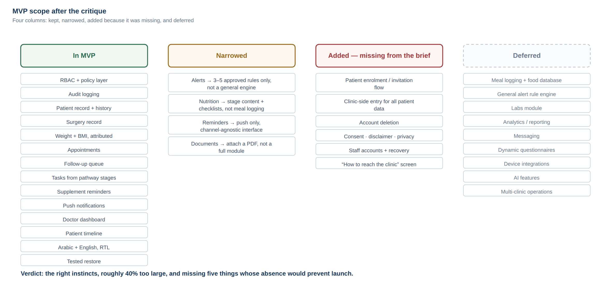
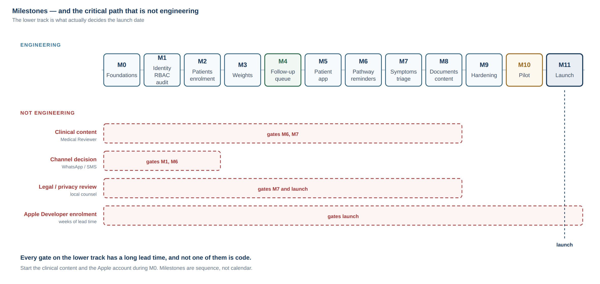

# 05 — MVP Recommendation (PART 8) and Roadmap (PART 9)

---

# PART 8 — MVP critique

The handoff (§67) asks me to criticise the proposed MVP before it is accepted. Here it is.

## 8.1 The proposed scope



> Patient authentication · Patient profile · Surgery info · Weight tracking ·
> Appointments · Reminders · Nutrition pathway · Supplements reminder · Basic patient
> tasks · Doctor dashboard · Patient timeline · Basic alerts · Basic reporting ·
> RBAC · Audit logging

**Verdict: the right instincts, roughly 40% too large, and missing five things whose
absence would prevent launch.**

It is a good list. Nothing on it is frivolous. The problem is that four items —
"nutrition pathway", "basic alerts", "basic reporting", and "reminders" — are each a
system rather than a feature, and together they are more work than everything else
combined.

## 8.2 What should be cut or narrowed

### Cut: "Basic reporting"
Analytics before there is data to analyse. At launch the clinic has zero historical
patients in the system; a reporting module reports on nothing. It is also the easiest
thing to add later, because it is read-only.
→ **Phase 2.** Replace with: the follow-up queue counts, which are operationally
necessary rather than analytical.

### Narrow sharply: "Basic alerts"
A general rule engine is the highest-risk component in the product, and building it before
the clinical rules exist means building it against imagined requirements.
→ **MVP ships a structured symptom check-in that routes to a human queue, with a very
small set of approved, versioned rules** — I would argue for three to five, not thirty.
The general engine is Phase 2, designed after the clinic has run the narrow version for
two months and knows what it actually needs. This is both safer and cheaper.

### Narrow: "Nutrition pathway"
A full protocol engine with meal logging, protein and calorie tracking, and adherence
scoring is several months of work and the part most likely to be redesigned after real
use.
→ **MVP ships stage-based content and checklists driven by configuration**: what phase
the patient is in, what they should be doing, and a simple daily confirmation. Protein and
fluid targets as simple numeric goals, if approved. Meal logging, food databases and
adherence scoring are **Phase 2**.

### Narrow: "Reminders"
A full notification engine with multi-channel delivery, preferences, quiet hours and
delivery tracking is substantial.
→ **MVP ships push only**, with per-category preferences, generic payloads, and delivery
records. SMS/WhatsApp is a channel decision (see [`06-OPEN-DECISIONS.md`](./06-OPEN-DECISIONS.md))
and, if chosen, is a Phase 2 addition on an interface designed for it now.

### Defer: patient-initiated free-text anything
Free text from patients creates an expectation of a reply. Not in MVP.

## 8.3 What is missing and must be added

These are not enhancements. Without them the product cannot launch.

### 1. Patient enrolment flow — **the most commonly overlooked thing in this class of product**
How does a patient actually get into the system? If the answer is "we send them a link",
adoption will be very low. The realistic answer is that the coordinator enrols them at the
desk, on their phone, before they leave — a clinic-generated invitation code or QR, scanned
in the app, tied to an already-created patient record. This single flow has more influence
on the project's success than any other MVP feature.

### 2. Clinic-side data entry on behalf of the patient
Already argued in [`00-READINESS-REPORT.md`](./00-READINESS-REPORT.md) §1.1. Every
patient-enterable datum must also be enterable by staff, with source attribution. This is
what makes the product work at 20% patient adoption, and it is what makes the pilot
possible before the app is even in the stores.

### 3. Account deletion
An App Store requirement for any app with account creation, and a reasonable expectation
regardless. It interacts with clinical retention — deleting an account must not silently
destroy a medical record — so it needs designing, not bolting on.

### 4. Consent, disclaimer, privacy policy screens
Needed for the stores, needed legally, and needed to set the expectation that this is not
an emergency service. Cheap to build, impossible to launch without.

### 5. Staff account management and credential recovery
Someone forgets a password on a Tuesday. If the answer is "Ali runs a SQL statement", the
product is not launchable.

### And one more: "how to reach the clinic"
Messaging is correctly excluded from MVP, but patients **will** try to message. A single
screen with the clinic's phone/WhatsApp and a clear statement of hours and of what to do
in an emergency prevents patients from using the symptom form as a chat window.

## 8.4 Recommended MVP scope

| Area | In MVP | Notes |
| --- | --- | --- |
| Identity & auth (staff) | ✅ | Password + recovery |
| Identity & auth (patient) | ✅ | Method `[DECISION REQUIRED]` |
| RBAC & policy layer | ✅ | Non-negotiable, built first |
| Audit logging | ✅ | Non-negotiable, built early |
| Clinic config & branding | ✅ | Minimal; one clinic |
| Patient record & medical history | ✅ | Fields `[MEDICAL REVIEW REQUIRED]` |
| **Patient enrolment / invitation** | ✅ | **Added** |
| Surgery record | ✅ | Procedures configurable |
| Weight & BMI, with source attribution | ✅ | Formulas `[MEDICAL REVIEW REQUIRED]` |
| **Clinic-side entry for all patient data** | ✅ | **Added** |
| Appointments + overdue detection | ✅ | The core business value |
| **Follow-up queue** | ✅ | **The product's reason to exist** |
| Patient tasks from pathway stages | ✅ | Content from Medical Reviewer |
| Supplement reminders | ✅ | Schedule from Medical Reviewer |
| Push notifications + delivery records | ✅ | Push only |
| Symptom check-in → human queue | ✅ | 3–5 approved rules only |
| Doctor dashboard (queues, search, filters) | ✅ | The primary screen |
| Patient timeline | ✅ | Read model |
| Patient app: home, weight, tasks, appointments, content | ✅ | Deliberately small |
| **Account deletion** | ✅ | **Added** |
| **Consent / disclaimer / privacy** | ✅ | **Added** |
| **Staff account management + recovery** | ✅ | **Added** |
| **"How to reach the clinic" screen** | ✅ | **Added** |
| Arabic + English, RTL | ✅ | From day one |
| Backups + tested restore | ✅ | Before any real patient data |
| Nutrition: meal logging, food DB, adherence scoring | ❌ | Phase 2 |
| General alert rule engine | ❌ | Phase 2 |
| Labs module | ❌ | Phase 2 — staff can attach a document in MVP |
| Documents/uploads | ⚠️ | Minimal: attach a PDF to a patient. Full module Phase 2 |
| Analytics / reporting | ❌ | Phase 2 |
| Messaging | ❌ | Phase 2, if at all |
| Dynamic questionnaires | ❌ | Phase 2 |
| Device integrations | ❌ | Phase 3 |
| AI features | ❌ | Phase 3 |
| Multi-clinic operations | ❌ | Phase 3 (`clinic_id` exists from day one) |

## 8.5 The sequencing recommendation — dashboard first

**I recommend building and launching the clinical dashboard before the patient app.**

This inverts the natural instinct, so the reasoning matters:

1. **The clinic gets value with zero patient installs.** Staff enter data, the follow-up
   queue works, overdue patients surface. That is already a product worth having.
2. **It de-risks the largest unknown.** Whether patients will engage is unknown and
   unknowable from here. Whether the clinic will use a good dashboard is much more
   predictable. Build the predictable value first.
3. **It removes the store from the critical path.** App review, certificates and Apple
   accounts cannot delay a web dashboard.
4. **It produces real data for the app to display.** A patient app launching against a
   populated record is a far better first impression than an empty one.
5. **Workflow mistakes get found early**, when they cost a week instead of a quarter.

The patient app follows immediately, into a system that already works.

**This is a recommendation, not a decision.** If there is a reason the patient app must
come first — a commitment made, a launch event, a competitive concern — say so and I will
plan for it. But I would argue this one.

---

# PART 9 — Roadmap



Milestones, not dates. Each is a coherent, demonstrable increment, and each ends with your
approval before the next begins (per the handoff's operating rules). Sizes are relative
effort, not calendar time.

### Milestone 0 — Foundations and decisions · **no product code**
Blocking decisions answered (`06-OPEN-DECISIONS.md`). Repository, monorepo skeleton,
environments, CI with a deliberately-failing-commit verification, ADRs for every decision
made, domain model and entity-relationship design reviewed by the second agent **before**
migrations exist, API contract conventions, error taxonomy, i18n/RTL foundation, security
baseline document. Human architecture review at the end.
*Exit: the design is written down and reviewed, and nothing about it depends on my memory.*

### Milestone 1 — Identity, RBAC, audit
Staff accounts, sessions, tokens, recovery. Roles and permissions as data. The policy
layer with its full authorization matrix under test. Audit event stream. Clinic record and
configuration.
*Exit: the authorization suite is green and a human has reviewed the auth design. Nothing
else is built until this is right.*

### Milestone 2 — Patients, enrolment, surgery records, timeline skeleton
Patient records, medical history (fields per Medical Reviewer), search with server-side
pagination, enrolment/invitation flow, surgery records, procedure configuration, timeline
read model.
*Exit: the coordinator can register a real patient and find them again. They try it.*

### Milestone 3 — Measurements and clinic-side entry
Weight, BMI, optional body measurements, source attribution, trends, staff entry on behalf
of patients, edit history.
*Exit: a weight recorded by staff appears on the trend and in the timeline.*

### Milestone 4 — Appointments and the follow-up queue · **the commercial core**
Scheduling, statuses, completed/cancelled/missed, overdue detection, loss-to-follow-up
rules, the ranked work queue, dashboard filters.
*Exit: the dashboard correctly identifies overdue patients from real clinic data. This is
the milestone that proves the product's premise.*

### Milestone 5 — Patient mobile app, first release
Auth, onboarding, consent and disclaimer, home with today's tasks, weight entry,
appointments, account deletion, the contact screen. Arabic-first, RTL.
*Exit: a real patient completes onboarding and records a weight, on their own phone.*

### Milestone 6 — Pathway stages, tasks, supplements, notifications
Protocol definitions and versioning, stage resolution, task generation, supplement
schedules, push notifications with preferences and delivery records.
*Exit: a patient receives the right task on the right post-operative day, under an
approved protocol version.*

### Milestone 7 — Symptom check-in and triage
Structured check-in, 3–5 approved versioned rules with their test tables, the human queue,
acknowledgement and closure with full audit, response-window and emergency copy.
*Exit: a submitted symptom appears in the nurse queue and is closed with a recorded
action. Legal review of this feature's copy has happened.*

### Milestone 8 — Documents and education content
Minimal document attachment with **API-proxied byte delivery** and access audit; educational content
targeted by procedure and stage.
*Exit: staff attach a lab report; the patient sees stage-appropriate content.*

### Milestone 9 — Hardening · **no new features**
Penetration test and remediation. Dependency and secret scanning. Load check at realistic
scale. Backup and **restore drill** executed for real. Incident response plan. Full RTL
and accessibility audit. Real-device testing on old Android and real iPhones. Error
tracking with PHI scrubbing verified. Runbooks tested by someone who did not write them.
*Exit: a human security reviewer and a human engineer both say yes.*

### Milestone 10 — Pilot
10–20 patients, selected by the clinic, enrolled face-to-face. Two to four weeks. The
explicit goal is finding workflow problems, not bugs. Engagement measured from patient #1.
*Exit: the clinic wants to continue, and we know the real engagement rate.*

### Milestone 11 — Store submission and launch
Human iOS developer engaged. Certificates, signing, builds. Store metadata, privacy
answers, age rating, reviewer demo account. Submission and review responses. Staged
rollout to the full panel.
*Exit: live, with real patients, and a plan for what happens when it breaks.*

### Phase 2 (post-launch, prioritised by what the pilot taught)
Full nutrition module · general alert rule engine · labs · dynamic questionnaires ·
messaging · analytics · data export (§75) · caregiver accounts · SMS/WhatsApp channel.

### Phase 3
Multi-clinic SaaS · clinic configuration portal · white-labelling · billing ·
device/health-platform integrations · clinician AI copilot · research exports.

## Critical path

The critical path is **not** engineering. It is:

```
clinical content (Medical Reviewer)  ──▶  M6, M7  ──▶  launch
channel decision (WhatsApp/SMS)      ──▶  M1, M6
legal review                         ──▶  M7, M11
Apple account + iOS developer        ──▶  M11
```

Every one of these has a long lead time and none of them is code. Start the clinical
content and the Apple account **now**, during Milestone 0.
