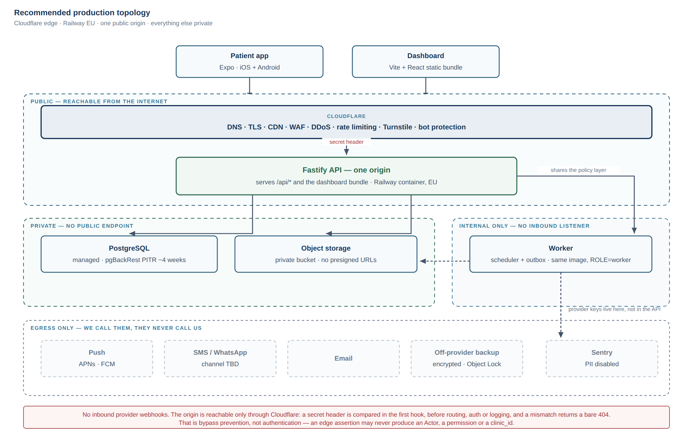
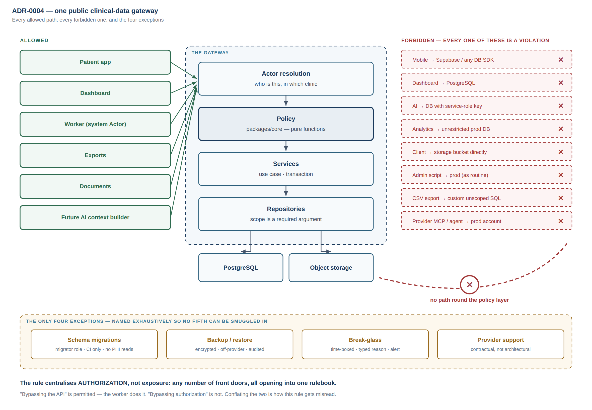

# 11 — Final Architecture Decision Addendum

**Scope:** two open questions only — the hosting/deployment decision, and whether to adopt
"One Public Clinical Data Gateway" as a binding rule.
**Baseline:** documents 00–10 and ADR-0001…0003 stand. Nothing here rewrites them.
**Status:** proposed. Not in force until the Product Owner writes
`HOSTING AND DATA ARCHITECTURE APPROVED`.
**Research date:** 2026-09-16.

---

## 0. How this was researched, and what that is worth

Provider facts below were re-verified against current sources on the research date rather
than recalled. That mattered more than expected: **three findings invalidate advice that
was correct six months ago**, and one of them is the kind of thing that decides a project.

Two honesty notes carried through the whole document:

- Several vendor pricing pages could not be fetched directly from this environment, so some
  figures come from search-index summaries rather than a primary page read end to end.
  Every such figure is marked. **Re-verify prices against the vendor's own page before
  committing spend.**
- **No latency figure here is a measurement.** Every RTT is an estimate from network
  topology. The measurement task is named in §5.

---

## PART 1 — The hosting decision

### 1.1 Gate 0: can Ali actually buy it?

Before any feature comparison, one question outranks all of them, and it is the question
architecture reviews routinely skip:

> **Which of these providers will accept a signup and a payment from Iraq?**

This is not hypothetical. **Google Cloud does not list Iraq as a signup country at all** —
it is absent from the billing-country dropdown, confirmed by community reports current to
within days of this research. That single fact eliminates GCP entirely, regardless of how
Cloud Run and Cloud SQL score on every other axis.

For the rest, the honest answer is: **not determinable from public sources.** Iraq is not
comprehensively sanctioned the way Iran, Syria, Cuba and North Korea are, so most providers
*should* work. But "should" is not a deployment plan. The practical barriers are signup
country lists, card acceptance, and automated compliance screening — none of which publish
their rules.

**Therefore: Gate 0 is an empirical test, executed before the hosting decision is
ratified.** For each shortlisted provider, in order: create an account with Iraqi billing
details, add the intended payment instrument, provision one trivial paid resource, and
confirm the charge settles. A provider that fails Gate 0 is eliminated no matter how well
it scores below. Budget a week; expect at least one failure.

> `[LEGAL REVIEW REQUIRED]` Iraq's current status under OFAC and EU sanctions as it affects
> cloud service provisioning. This is a legal question and nothing in this document should
> be read as advice on it.

This also produces a design requirement, not just a task: **the architecture must survive a
failed Gate 0.** Everything recommended below is a plain container, plain PostgreSQL and a
plain S3 API precisely so that a provider rejection costs a redeploy rather than a rewrite.

### 1.2 What changed in 2026, and why it settles three options

| Finding | Verified | Consequence for this project |
| --- | --- | --- |
| **AWS Middle East regions hit by drone strikes, March 2026.** `me-central-1` (UAE) lost AZ `mec1-az2` to physical strikes — 109 services affected. `me-south-1` (Bahrain) went fully dark for ~7h23m on 14 March and is reported still unavailable due to the ongoing regional conflict. | Yes | **The "host in the Gulf for lower latency to Iraq" argument is dead.** The nearest regions to Iraq are the ones with a live physical-conflict risk. This is not an availability abstraction; it is the same regional instability the clinic itself operates in. Europe is now the correct region on *resilience* grounds, not merely convenience. |
| **AWS App Runner closed to new customers on 30 April 2026**, moved to maintenance. ECS Express Mode is the named successor. | Yes | The simplest realistic AWS path no longer exists for a new account. ECS Express Mode is real and costs nothing extra, but it deploys pre-built images only, has no scale-to-zero, and still sits on VPC + IAM + ALB. |
| **Google Cloud does not accept Iraq as a billing country.** | Yes | GCP eliminated at Gate 0. |

### 1.3 Provider assessment

Scored for *this* project: one operator, no ops team, bootstrapped, real medical data,
hundreds of patients a month growing into tens of thousands of records, Iraq.

| Provider | Verdict | Deciding reason |
| --- | --- | --- |
| **Railway** | **Selected** | Managed PostgreSQL on pgBackRest with a **~4-week PITR window** (4 rolling full backups, restore to any second). Restore **provisions a new service and never touches the source** — which is what makes the mandated restore drill safe to automate. First-party S3-compatible buckets on the private network with **free egress**. Private networking between API, worker and DB. Sealed variables that cannot be read back. |
| **Render** | **Second best** | Genuinely close. Managed PostgreSQL with PITR, Frankfurt, background workers as first-class, `render.yaml` as infrastructure-as-code. Loses on two narrow points: a shorter PITR window (7 days on paid tiers; 3 days on Hobby, which is disqualifying) and no first-party object storage, so documents need a third vendor and paid egress. |
| **Fly.io** | Viable third | Machines + Managed Postgres in `fra`, good private networking. Managed Postgres is the newer offering and its backup retention is the weakest of the three; mixed reliability record. Choose if Railway and Render both fail Gate 0. |
| **Hetzner** | **Rejected as primary; adopted for one job** | Cheapest compute by a wide margin and **sells no managed PostgreSQL**. Self-managing PITR, failover, patching and monitoring for clinical data, by a solo operator who has never completed a restore drill, is the single worst risk/benefit trade available here. Adopted only as an off-provider backup target. |
| **AWS** | **Rejected as primary; adopted for one job** | App Runner closed; ME regions compromised; the surviving build (ECS Fargate + ALB + NAT + RDS) is ~$130–195/month for production alone *(figure from research, unverified against AWS's calculator)* and adds VPC, IAM and a hand-rolled deploy pipeline. That is precisely the class of accidental complexity that put `student-os` into a production 502. Retained as a candidate for immutable off-provider backup (S3 + Object Lock). |
| **Google Cloud** | **Eliminated** | Gate 0. Iraq is not a supported billing country. |
| **Azure** | Escape hatch only | Has UAE North / Qatar Central, but those carry the same regional exposure as AWS's ME regions, and Azure's operational surface is the largest of any option here. |
| **Supabase** | **Rejected as a platform; rejected as plain Postgres** | As a platform it is a *second authorization implementation* (RLS), a *second public origin*, and a `service_role` key whose leakage is unbounded — see §3 and ADR-0004. As merely managed Postgres it costs multiples of Neon for this size, largely on a PITR add-on. |
| **Neon** | Viable DB-only | Good serverless Postgres with branching, `eu-central-1`. A reasonable substitute if Railway's DB specifically disappoints; adds a vendor. |
| **DigitalOcean** | Peer of Render | App Platform + Managed PostgreSQL + Spaces in FRA1. A legitimate Gate 0 fallback, not a superior option. |
| **Cloudflare** | **Selected, for the edge only** | See §1.4. |

### 1.4 Cloudflare: selectively, and the reason is Iraq

The right question is not "can the backend run on Cloudflare" — it cannot, comfortably.
Fastify is a Node HTTP server, the worker is a long-lived process, and PostgreSQL wants
persistent connections; Workers is a V8-isolate runtime that fights all three, and D1 is
SQLite, not PostgreSQL. Adopting D1 would also destroy the only backup and restore tooling
this team has, in service of a non-negotiable (a tested restore before real patient data)
that has never actually been completed.

**But Cloudflare earns its place at the edge on a project-specific fact.** Cloudflare
operates points of presence **inside Iraq — Baghdad, Basra, Erbil, Najaf, Nasiriyah and
Sulaymaniyah** — the widest in-country footprint of any CDN. With the origin in Frankfurt,
TLS termination in-country removes the handshake round trips from the slowest part of the
path, which is the part that actually hurts a patient on Zain or Asiacell.

| Use | Decision |
| --- | --- |
| DNS, TLS termination, CDN, DDoS protection | **Adopt** |
| WAF + edge rate limiting (Pro zone, ~$20/mo *unverified*) | **Adopt** |
| Turnstile on enrolment, login and OTP-request endpoints | **Adopt** |
| Bot protection | **Adopt** at the zone default |
| Origin lockdown | **Adopt** — see §2.3; without it the WAF is decorative |
| R2 object storage | **Not adopted.** Railway's buckets are on the private network with free egress, which is what makes byte-proxying affordable (§3.6) |
| Workers / Workers Containers as app runtime | **Reject** |
| D1 | **Reject** — not PostgreSQL |
| Hyperdrive, Queues | **Reject** — solving problems this topology does not have |
| Cloudflare Access on the clinical hostname | **Deferred**, not rejected — see §3.4 |

**One caveat that must be configured, not assumed:** an authenticated JSON API behind a
misconfigured "Cache Everything" rule will serve one patient's response to another patient.
The zone must carry an explicit rule that `/api/*` is never cached, and that rule is a test,
not a note.

> `[LEGAL REVIEW REQUIRED]` No Cloudflare product offers an Iraq or Middle East data
> residency boundary. If Iraqi law requires in-country residency, **this entire
> recommendation fails** and the decision reopens with a much worse option set.

---

## PART 2 — The production topology

### 2.1 Component placement

| Component | Runs on | Exposure |
| --- | --- | --- |
| DNS | Cloudflare | Public |
| TLS termination (edge) | Cloudflare | Public |
| CDN, DDoS, WAF, bot, Turnstile, edge rate limits | Cloudflare | Public |
| **Fastify API** (serves `/api/*` **and** the dashboard's static bundle) | Railway container, EU region | **Public via Cloudflare only** |
| **Worker** (scheduler + outbox relay) | Railway container, same image, `ROLE=worker` | **No inbound. Internal only** |
| Dashboard (Vite + React static bundle) | Built in CI, baked into the API image, served by Fastify at `/` | Public assets; no data path of its own |
| Patient mobile app | Expo, App Store / Play | Client |
| PostgreSQL | Railway managed Postgres, same project/private network | **Private. No public endpoint** |
| Object storage | Railway Buckets, private network | **Private. No public endpoint, no presigned URLs** |
| Backups (primary) | Railway pgBackRest, ~4-week PITR | Provider-internal |
| Backups (off-provider) | Nightly `age`-encrypted `pg_dump` + object mirror to **Backblaze B2 or AWS S3 with Object Lock** | Write-only credential from the worker |
| Secrets | Railway sealed variables (runtime); GitHub Actions secrets (CI) | Never in the repo, never in a client bundle |
| Error tracking | Sentry **on its EU data region**, PII disabled, no request bodies | Egress only. Region matters: telemetry to a US-region vendor is a cross-border transfer that `[IRAQI LEGAL REVIEW REQUIRED]` must be told about |
| Logs | Structured `pino` to stdout → platform sink, central redaction list | Egress only |
| Audit events | **A PostgreSQL table**, not logs — see §2.4 | Internal |
| Uptime check | External monitor on `/health/ready` | Public probe of a PHI-free endpoint |
| CI/CD | GitHub Actions → image build → Railway deploy | — |

### 2.2 Zones

```
PUBLIC (reachable from the internet)
  Cloudflare edge          — DNS, TLS, WAF, CDN, rate limits, Turnstile
  Fastify API              — one origin, ONLY via Cloudflare
  Dashboard static assets  — served by the same origin, carry no data

PRIVATE (reachable only from inside the provider's project network)
  PostgreSQL               — no public endpoint
  Object storage           — no public endpoint, no presigned URL code path

INTERNAL-ONLY (no inbound listener at all)
  Worker                   — outbound to DB, storage, and providers

EGRESS-ONLY (we call them; they never call us)
  APNs / FCM · email · SMS / WhatsApp · Sentry · off-provider backup
```

**There are no inbound provider webhooks in v1.** The worker polls delivery status
outbound. A second inbound public path that nobody specified is not accepted by default; if
a provider later forces one, it lands on a single path with HMAC verification plus an IP
allowlist at the WAF, and its handler **never resolves an Actor and never touches PHI**.

### 2.3 Origin lockdown — the control that makes the edge real

A WAF in front of an origin that is still directly reachable by IP or platform hostname is
decoration. Railway assigns a world-reachable `*.up.railway.app` hostname, so:

1. Cloudflare injects a secret header on every proxied request.
2. The **first** Fastify hook — before routing, before auth, before logging — compares it
   with `timingSafeEqual` and returns a bare 404 on mismatch.
3. The secret is a sealed variable, rotated on any suspicion.

This is a **bypass-prevention control, not authentication**, and the document says so
because the failure mode is a developer later treating the header's presence as trust.
Cloudflare Tunnel is the stronger version — the origin then has no inbound listener at all —
and becomes the right answer the day the origin is a VM rather than a managed container.
On a PaaS with no OS access it costs a sidecar daemon whose failure is a total outage with
a confusing cause, which is a poor trade at this size.

### 2.4 Two things that are deliberately not where you would expect

**The audit trail is a database table, not a log stream.** Logs are ephemeral, live with a
vendor, and have a retention window someone else chooses. An audit trail that cannot answer
"who opened this patient's file, and when" a year later is not an audit trail. Putting it in
PostgreSQL means it is backed up, restorable and queryable by the same mechanisms as
everything else. Application logs remain separate, redacted and disposable.

**The dashboard has no server.** It is a static bundle served by the API process at the same
origin. This removes a deployable, a second credential holder, a second place that could
resolve an Actor, CORS entirely, and an entire framework's server-side auth semantics. For
an authenticated internal tool used by a handful of clinicians, with no SEO requirement and
no anonymous traffic, a Next.js server is pure cost. **This overturns the Next.js choice in
document 03**, and it is the only baseline decision this addendum revisits.

### 2.5 Diagram



---

## PART 3 — "One Public Clinical Data Gateway", attacked before it is adopted

### 3.1 First, fix the statement

The proposed wording says "ONE authoritative application gateway" and then correctly notes
this does not mean one server, process or container. That nuance is right but it is doing
too much work in a footnote, and a rule that needs a footnote gets misread.

**The rule is about authorization, not about exposure.** Sharpened:

> Every read or write of clinical data, from any client, service, job or tool, resolves an
> Actor and passes the same policy implementation before any repository call.

That formulation survives the attacks below; "one public entry point" does not. The two are
routinely conflated and they are different claims: one is about *how many rulebooks exist*,
the other about *how many front doors exist*. Only the first is non-negotiable.

### 3.2 The attacks

**"It is a bottleneck."** At the stated scale, no. A few thousand requests a day against a
policy layer of pure synchronous functions over a pre-resolved Actor is not a measurable
cost. The honest version of this objection is about *document bytes*, not policy — proxying
large files through the API does consume a connection for the duration. §3.6 addresses it
directly. **Objection does not survive at this scale; the trigger to revisit is named.**

**"It is a single point of failure."** This confuses the policy boundary with the process.
One rulebook does not imply one replica. The API can run N replicas behind the edge and
remain one gateway, because the gateway is the *code path*, not the container. What *is*
genuinely single is PostgreSQL, and that is true in every architecture considered here,
including the Supabase one. **Objection does not survive.**

**"It harms scalability."** The scaling limits here are PostgreSQL connections and document
bandwidth. Neither is caused by centralised authorization. A direct-to-database client
architecture does not scale *better*; it scales the same and audits worse. **Objection does
not survive.**

**"It complicates the worker."** This is the strongest version of the objection and it
deserves a real answer, in §3.3. **Partially survives — and changes the rule's wording.**

**"AI will need broad data access."** It will not, and this is exactly where the rule earns
its keep. An AI context builder is a *caller*, like any other: it resolves an Actor, calls
the same policy functions, and receives only what that Actor could have read through the
API. What it must never receive is a credential that reads more. **Objection does not
survive; see ADR-0004.**

**"Analytics needs unrestricted SQL."** Partly true, and the rule must say what is allowed
rather than pretend the need does not exist. §3.5. **Partially survives.**

**"Multi-clinic will force a second path."** The opposite. Multi-tenancy is the case where a
single scope-resolution point is worth most, because `clinic_id` leakage is the failure that
ends the business. **Objection does not survive.**

### 3.3 The worker: reuse the layer, do not call the API

The question "should internal services call the API over HTTP, or reuse the policy and
domain layer in-process?" has a clear answer here: **reuse the layer.**

An internal HTTP hop between two processes inside the same trust boundary buys nothing —
the same code, the same database, the same deployment — and costs a network failure mode, a
serialisation boundary, and a service credential that becomes a bearer token for everything.
That credential is precisely the "second privileged path" the rule exists to prevent.

So the worker imports `packages/core/policy` and the repositories, exactly as the API does,
and runs under a **per-job `JobActor`** — not one shared system identity, which would be an
unscoped god worker by another name. Each JobActor carries a concrete `clinic_id` and a
narrow declared table scope; the model is specified in
[`12-REVIEW-RESPONSE-AND-ACCESS-DESIGN.md`](./12-REVIEW-RESPONSE-AND-ACCESS-DESIGN.md) §4. The rule's wording is therefore *one policy implementation*, not *one process* — and
the auditability requirement is met by the JobActor writing audit events that name the
job and rule that caused the action, so an automated write is never indistinguishable from a
human one.

### 3.4 One rulebook, but how many front doors?

A serious counter-proposal argued for **two hostnames with deliberately different exposure**:
the patient API open to the world (patients arrive from arbitrary mobile IPs), and the
clinical surface behind Cloudflare Access, so the highest-value surface — see every patient,
export everything — is not reachable by anonymous internet traffic at all. Both terminate in
the same process and the same policy module.

This is a good argument and it is compatible with the rule as sharpened in §3.1. It is
**deferred rather than adopted** for v1 on two practical grounds: it introduces an identity
provider dependency for a three-person clinic, and if Access is misconfigured or unavailable
the clinic cannot work at all — an availability risk traded for a real but secondary
exposure reduction.

What is adopted now instead, at no operational cost: **the same process serves both
surfaces, and every route declares its surface tag derived from its policy.** Staff-only
routes are tagged clinical automatically. That makes the later split a configuration change
rather than a redesign, and in the meantime the WAF applies different rate limits and bot
posture per path prefix.

**Revisit when:** the clinic adopts any SSO identity provider, or staff count exceeds ~10,
or a credentialed-insider incident occurs.

### 3.5 Exports and analytics

Both are real needs and both are where centralised authorization is most often quietly
abandoned. The allowed shapes:

- **Exports** run through the same scope resolution as a list query. An export is a
  privileged *read*, not a different kind of access: same `patientScopesFor(actor)`, pushed
  into the same `WHERE`. Every export writes an audit event recording the actor, the filter
  and the row count, and exports are rate-limited and alerted on — because a compromised
  staff account quietly exporting the panel is the most likely real breach in a clinic, and
  no authorization rule can stop it. Only detection can.
- **Analytics** runs against a **restored backup or a read replica**, never against
  production with an unrestricted role, and against data with direct identifiers removed. If
  a question genuinely needs identifiers, it is a report and it goes through the API.

### 3.6 Documents: proxy the bytes

**Decision: no presigned URL code path exists in v1.** Every document byte is streamed
through the API so the policy call runs and an audit row is written.

This reverses the usual instinct, so the reasoning matters:

1. **A presigned URL is a bearer token inside a URL.** In this user population it will land
   in screenshots, WhatsApp forwards and the Android share sheet. That is a realistic leak
   vector, not a theoretical one.
2. **You cannot audit a read that never reaches your API.** Minting a URL records
   authorization; it does not record delivery. For clinical documents that distinction is
   the whole point of the audit trail.
3. **The cost objection is gone.** Railway's buckets sit on the private network with free
   egress, so the bandwidth argument that normally makes proxying unattractive does not
   apply. This is a concrete example of the hosting choice and the security design being
   decided together rather than in sequence.

**Named trigger to revisit**, stated now so it cannot be smuggled in later: sustained
document reads roughly two orders of magnitude above pilot, or single objects above ~100 MB.
If adopted then, TTL ≤ 60 seconds, single-use nonce recorded in the database, and a written
acknowledgement that the audit row records authorization, not delivery.

### 3.7 Verdict

**Adopt**, with the sharpened wording. The principle survived every attack except two, and
both of those changed the wording rather than the decision: the worker reuses the policy
layer instead of calling an API, and "one gateway" governs authorization rather than
exposure. See `adr/0004-one-public-clinical-data-gateway.md`.



---

## PART 4 — The ADR

Written as [`adr/0004-one-public-clinical-data-gateway.md`](adr/0004-one-public-clinical-data-gateway.md),
including the violation table the brief asked for.

---

## PART 5 — Hostile security review

> **Note on scope:** the brief's Part 5 was truncated mid-sentence after "service-role
> abuse". This section covers the attack classes that were listed plus the ones that follow
> from this topology. Tell me what was cut and I will extend it.

### 5.1 The finding I would escalate first

**An AI agent session connected to the production hosting account is a second privileged
data path, and it is the most likely one to appear on this project.**

This is not hypothetical. The session writing this document has tools available named
`mcp__Render__query_render_postgres` and `mcp__Render__update_environment_variables`. Any
provider MCP integration of that shape, connected to a production workspace, can read the
clinical database and rewrite secrets **without traversing the API, the policy layer, or the
audit trail** — which is the precise definition of a gateway violation in ADR-0004.

On a project whose stated working model is "Claude Code + Codex do most of the
implementation", this is the highest-probability bypass in the entire system, and it arrives
through a convenience feature rather than an attack.

**Control:** production provider accounts are never connected to an AI agent session. Agent
tooling is restricted to development and staging workspaces. This belongs in the ADR's
forbidden list, in the operator runbook, and in the onboarding of any future contributor.

### 5.2 IDOR / BOLA and broken object-level authorization

The dominant risk in this system. The defences, in order of strength:

1. **Make the mistake impossible to express.** Repository functions take a `Scope` value that
   only the policy layer can construct. `findMeasurements(scope, …)` cannot be called with a
   raw `patientId` from a request body, because the type does not permit it. Forgetting
   becomes a compile error rather than a code-review hope — this is the single
   highest-leverage control and it costs almost nothing in TypeScript.
2. **Fail at boot, not at review.** Every route schema carries a required `policy` property;
   the process **exits at startup** if any registered route lacks one. This directly repairs
   ADR-0003's own stated weakness, that nothing fails when someone skips the policy layer.
3. **A route-inventory test.** Every registered route must appear in the authorization test
   matrix; CI fails when a new route is added without one. This is what makes the guarantee
   hold under AI-generated code, where volume outpaces review.
4. **Never fetch-then-filter.** Scope goes into the `WHERE` clause. Filtering after the fetch
   leaks row counts through pagination and returns short pages.
5. **Identical responses for "not found" and "not yours."** Otherwise the 403/404 difference
   is a patient-existence oracle.

### 5.3 Cross-patient and cross-clinic leakage

Cross-patient leakage is IDOR and is handled above. Cross-clinic is different in
consequence: it is the failure that ends the business when clinic #2 exists.

**Recommendation — and it differs from both proposals I reviewed.** Do not enable PostgreSQL
row-level security in v1, and do not defer its *plumbing*:

- From the first migration, **all database access goes through one `withActor()` transaction
  helper** that sets `app.clinic_id` as a transaction-local setting. A lint rule forbids
  importing the connection pool anywhere else.
- RLS **policies** are added at the multi-clinic milestone, as a migration only, with a hard
  constraint: a policy may encode `clinic_id = current_setting('app.clinic_id')` and
  **nothing else**. Any policy referencing a role, permission or patient assignment is
  forbidden.

The reasoning: with one clinic, RLS protects against nothing today, so paying its debugging
cost now is waste. But retrofitting it later normally means auditing every query path again —
unless the GUC plumbing already exists, in which case enabling it is a migration. The
constraint to `clinic_id` only is what prevents RLS becoming the second rulebook ADR-0003
warns about: it expresses an *invariant*, not a *policy*.

### 5.4 Service-role abuse

The canonical second path, and the strongest argument against the Supabase platform model: a
`service_role` key bypasses RLS entirely and, once it exists, migrates toward whatever code
is most convenient. **This topology has no such credential by construction** — there is no
key that reads more than an Actor may read.

The credentials that do exist are separated by deployment: the API container holds database
and storage credentials; the **worker holds the provider keys** (FCM, SMS, WhatsApp) that the
API never needs. A compromise of the public-facing process therefore does not yield the
messaging credentials. This is the main reason the worker stays a **separate container from
the same image** rather than an in-process loop, despite the event volume being low enough to
justify merging them.

### 5.5 Other paths a developer could take by accident

| Path | Why it happens | Control |
| --- | --- | --- |
| A repository query written without scope | Fastest way to make a feature work | Branded `Scope` type; lint rule; route-inventory test |
| Storage SDK imported into the dashboard or app | Copy-paste from a tutorial | `no-restricted-imports` on client packages; CI check on the built bundle |
| A secret committed | Routine | `gitleaks` in CI; sealed variables; a leak probe that boots the built image and asserts no secret appears in any response |
| A migration that reads PHI | Convenience during a data fix | Migrations run under a `migrator` role whose credential is absent from the API container |
| An admin script against production | A genuine emergency | Break-glass only: separate credential, time-boxed, typed reason, out-of-band alert — never routine |
| Debug logging of a request body | Debugging a real incident | Central `pino` redaction keyed to the data classification; a test asserting no clinical field name appears in log output |
| Clinical detail in a push payload | Making the notification useful | Generic payloads enforced by test; the app fetches detail after authentication |

### 5.6 The attack that no authorization design prevents

A credentialed clinician reading 300 patient records at 02:00 is indistinguishable, to the
policy layer, from a clinician doing their job. Authorization cannot stop it; **only
detection can**, and this is the most likely real breach in a small clinic.

Therefore, as a v1 requirement rather than a later enhancement: **bulk-access anomaly
detection** over the audit table — reads per actor per hour, exports per actor per day,
access to patients outside an actor's assignment — with a real-time alert and a monthly
review. Break-glass access to an unassigned patient is *allowed*, because refusing it would
get the control worked around, but it requires a typed reason and fires an alert.

---

## Summary of decisions

| # | Decision |
| --- | --- |
| 1 | **Gate 0 first:** empirically verify Iraqi signup and payment per provider before ratifying anything. |
| 2 | **Edge: Cloudflare** — DNS, TLS, CDN, WAF, DDoS, rate limiting, Turnstile, bot. Not the app runtime. Not R2. |
| 3 | **App + DB + storage: Railway, EU region.** Render second, Fly third. |
| 4 | **Off-provider encrypted immutable backup** to a third vendor, drilled monthly in CI. |
| 5 | **Origin locked** to Cloudflare by a secret header checked before anything else. |
| 6 | **Dashboard becomes a static SPA** served by the API process. Next.js removed. *(Overturns doc 03.)* |
| 7 | **Worker stays a separate container from the same image**, for credential separation. |
| 8 | **Adopt ADR-0004**, with authorization — not exposure — as the thing centralised. |
| 9 | **No presigned URLs for PHI in v1.** Proxy every byte. |
| 10 | **RLS plumbing from day one; RLS policies at multi-clinic**, constrained to `clinic_id`. |
| 11 | **No production provider account is ever connected to an AI agent session.** |
| 12 | **Bulk-access anomaly detection is v1 scope**, not a later enhancement. |

## What remains open

**Ali decides:** Gate 0 results; whether to accept the Next.js removal; whether the
two-hostname split is wanted earlier than §3.4 proposes; the off-provider backup vendor.

**Requires Iraqi legal review:** whether in-country data residency is required (**if yes,
this entire recommendation fails**); Iraq's sanctions status as it affects provisioning;
whether storing Iraqi patients' records in Germany under a German or US processor is
permitted.

**Requires human security review:** the authorization matrix and the branded-`Scope`
mechanism; the origin-lockdown configuration; the break-glass procedure; and a penetration
test focused on object-level authorization before real patients.

**Must be measured, not estimated:** RTT from Zain, Asiacell, Korek and a fixed line to
Frankfurt, and whether Iraqi ISPs peer with Cloudflare's in-country PoPs or backhaul via
Europe. The second determines whether the edge argument in §1.4 holds at all.

## Sources

Verified 2026-09-16: AWS Middle East outage and drone strikes —
[Data Center Knowledge](https://www.datacenterknowledge.com/outages/aws-middle-east-outage-after-data-center-hit-by-unidentified-objects),
[Cybersecurity News](https://cybersecuritynews.com/aws-middle-east-services-disrupted/),
[AWS re:Post](https://repost.aws/questions/QUjeF4ITrjQ9aMcaLhvZfTvQ/me-central-1-outage-s3-data-inaccessible-cross-region-copy-to-ap-south-1-failing).
App Runner closure — [AWS documentation](https://docs.aws.amazon.com/apprunner/latest/dg/apprunner-availability-change.html).
ECS Express Mode — [AWS migration guide](https://dev.to/ustun/a-practical-guide-to-moving-from-aws-app-runner-to-ecs-express-mode-1fe3).
Google Cloud billing countries —
[Google Cloud community](https://discuss.google.dev/t/iraq-missing-from-google-cloud-signup-country-list/397083).
Railway PITR — [Railway docs](https://docs.railway.com/volumes/point-in-time-recovery).
Cloudflare Iraq PoPs — [Cloudflare network](https://www.cloudflare.com/en-gb/network/),
[CDN Planet](https://www.cdnplanet.com/geo/iraq-cdn/).
