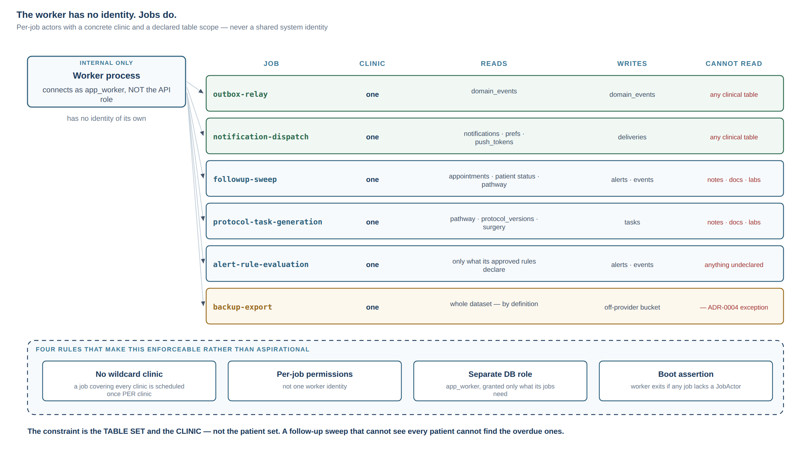
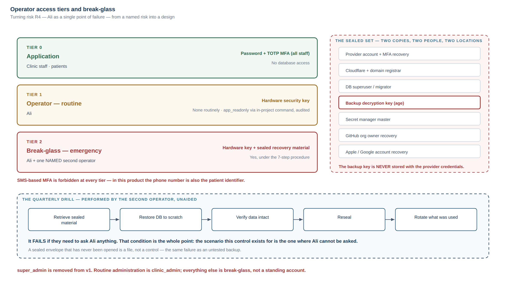
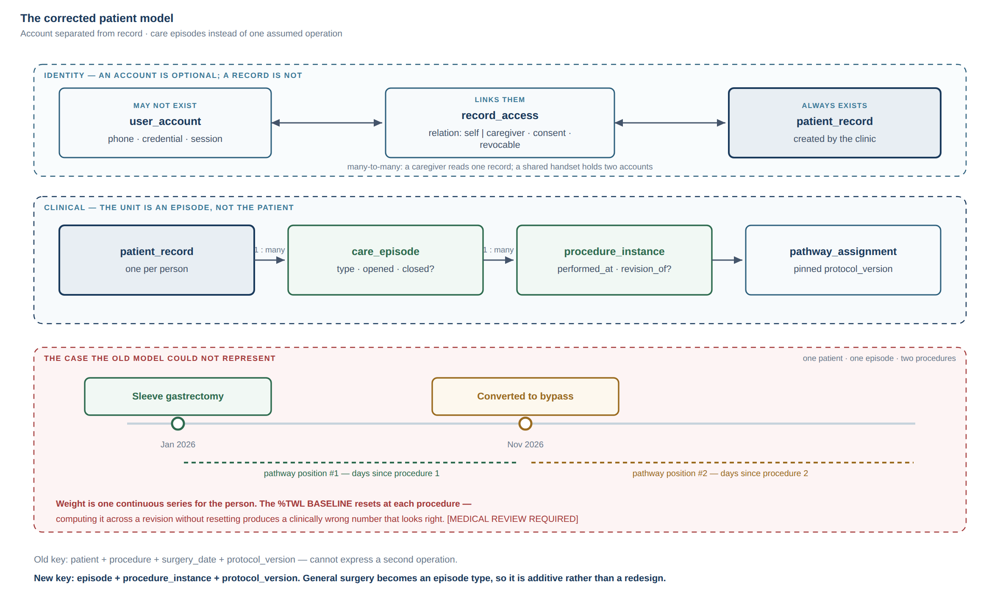

# 12 — Review Response and Access Design

**Responds to:** the review notes of 2026-09-16.
**Scope:** close the six raised items with the minimum documentation necessary. No code, no
new scope, no rewrite of the baseline.
**Status:** proposed. Not in force until `ARCHITECTURE APPROVED`.

> **Items 7–23 are now addressed in §8.** The original notes were truncated mid-item-6 on
> three consecutive sends; the remaining items arrived as a summary on the fourth and are
> closed below.
>
> **A correction to an earlier version of this document.** It stated that items 7+ were not
> addressed and, a few pages later, that "approval is blocked by items 16 and 17 only". Those
> two statements cannot both be true, and the reviewer was right to refuse approval on that
> basis alone. A checklist that declares itself nearly complete while half the review is
> unread is worse than no checklist. §8 closes the gap; the checklist below is recounted.

---

## Verdicts at a glance

| # | Item | Verdict | Priority | Where it stands now |
| --- | --- | --- | --- | --- |
| 1 | Hosting architecture not closed | **RESOLVED** — but the review found a real defect it did not intend | **P0** (the defect) | Doc 11 §1.3, §1.4, §2.1, §2.2. Doc 03 was stale and contradicted it |
| 2 | Network topology not specific enough | **PARTIALLY RESOLVED** | **P0** | §2 below closes four genuine gaps |
| 3 | Gateway needs precise definition | **PARTIALLY RESOLVED** — and the note's framing is better than mine | **P0** | ADR-0004 amended; §3 below |
| 4 | Worker as a second privileged path | **NOT RESOLVED** | **P0** | §4 below: per-job actors, not a god worker |
| 5 | Challenge `super_admin` | **NOT RESOLVED** — note is correct | **P0** | §5 below: removed from v1 |
| 6 | Break-glass not designed | **PARTIALLY RESOLVED** | **P0** design / **P1** drill | §6 below |

---

## 1. Hosting — RESOLVED, and the note found something better

**Verdict: RESOLVED.** Every item the note lists was decided in document 11, published
before these notes:

| Asked for | Decided in |
| --- | --- |
| Exact provider, region, API / worker / PostgreSQL / storage / dashboard / edge location, private networking, DB reachability, monitoring, backups | Doc 11 §2.1 (component placement table) and §2.2 (zones) |
| Provider recommendation with reasoning | Doc 11 §1.3 |
| Edge/DNS/WAF position | Doc 11 §1.4 |
| Origin bypass protection | Doc 11 §2.3 |
| Topology studied as a whole rather than service by service | Doc 11 §2, diagram `d11-topology` |

**But the note is right that something was not closed, and it is worse than an open
decision — it is a contradiction.** `03-STACK-EVALUATION.md` line 203 still read:

> `| Hosting | Container host + managed PostgreSQL | [DECISION REQUIRED] — follows residency |`

Two source-of-truth documents disagreeing about whether a P0 decision has been made is
exactly the failure §65 of the original handoff exists to prevent, and a reviewer reading
document 03 alone would correctly conclude the hosting decision was open. **Fixed:** doc 03
now records the decision and points to doc 11.

**Two sub-points genuinely needed tightening, and are now specified:**

- **Exact region.** "EU" was not precise enough. The intent is Railway's European region
  (Amsterdam, `europe-west4` on Railway's current Metal regions) for **API, worker,
  PostgreSQL and object storage in one project on one private network**. `[VERIFY]` the
  exact region identifier against Railway's console during Gate 0 — region names move.
- **Why one provider for all four.** Deliberate, not incidental: co-locating API, worker, DB
  and storage on one private network means **zero cross-provider egress on the hot path, no
  public transit for database traffic, and a single failure domain that is easier to reason
  about than four correlated ones.** Splitting storage to a different vendor would add egress
  cost, a second credential, and a second availability dependency for every document read.
  The off-provider backup is the one deliberate exception, and it is off the hot path.

`[IRAQI LEGAL REVIEW REQUIRED]` — residency remains unknown. The engineering recommendation
above stands **under the stated assumption that no in-country residency requirement exists**.
If one does, this recommendation fails and the option set gets materially worse (no
mainstream PaaS has an Iraq region).

---

## 2. Network and access topology — the four real gaps

**Verdict: PARTIALLY RESOLVED.** Doc 11 §2.2 defines the zones and §2.3 already answers the
note's own sharpest point — *"a diagram labelled Cloudflare → API is not enough if the
original hostname remains directly reachable"* — with the secret-header origin lockdown.
Four questions were genuinely unanswered.

**One reframe first.** The note asks for a `MANAGEMENT-ONLY` network zone. On a managed
platform that category does not exist as a *network* zone: management is the provider's
console and API, reachable from the internet by definition, protected by account security
rather than by network position. Modelling it as a network zone would describe a control we
do not have. It is modelled below as an **access tier** instead, which is what it actually
is.

### 2.1 Component exposure — the definitive table

| Component | Classification | Public IP / inbound? |
| --- | --- | --- |
| Cloudflare edge | **PUBLIC** | Yes, by design |
| Fastify API (incl. dashboard bundle) | **EDGE-EXPOSED** | Platform hostname exists but rejects any request lacking the Cloudflare secret header (bare 404) |
| Worker | **INTERNAL-ONLY** | No HTTP domain assigned. No inbound listener. Outbound only |
| PostgreSQL | **PRIVATE** | **No.** Railway's public TCP proxy is **disabled** and stays disabled |
| Object storage | **PRIVATE** | **No.** No public endpoint, no public listing, no anonymous read, no presigned URL path in v1 |
| Backups (off-provider) | **PRIVATE** | Write-only credential held by the worker; separate vendor |
| Provider console / CI | **MANAGEMENT** (an access tier, not a network zone) | Internet-reachable; protected by account MFA, §6 |

### 2.2 The four questions

**Does PostgreSQL have a public IP?** No. Railway Postgres is reachable at
`*.railway.internal` on the project's private network. The optional public TCP proxy is the
one setting that would undo this, so it is **explicitly disabled, and its state is a
reviewed item in the pre-production checklist** — not an assumption.

**Can an engineer's laptop connect directly to production PostgreSQL?** **No — not as
routine, and this is a deliberate constraint rather than an oversight.** Three sanctioned
paths exist instead:

| Need | Path |
| --- | --- |
| Investigate a data question | A one-off command run *inside* the project network under the read-only `app_readonly` role, output audited |
| Apply a schema change | Migrations, below |
| Genuine emergency | Break-glass, §6 — which includes temporarily enabling the proxy, and mandatory credential rotation afterwards |

**How are migrations executed?** CI never connects to the database. CI builds the image, then
**triggers a one-off command inside the project's private network** which runs the migrations
under the dedicated `migrator` role. The `migrator` credential is never present in the API or
worker containers, and migrations must not read PHI (ADR-0004 exception 1). This keeps the
database unreachable from outside the project while still automating schema change.

**Which firewall / security-group rules exist?** **On a managed platform: none, and pretending
otherwise would be dishonest.** There are no VPCs or security groups to write. What exists
instead:

- Private networking between services by default; public exposure is opt-in per service and
  is enabled for exactly one (the API).
- The Cloudflare secret header as the origin's only admission control.
- Platform account security as the management boundary.

This is a **real trade for the operational simplicity**, and it is the strongest argument
anyone can make for a VPC-based host such as AWS. It is accepted knowingly because the
alternative costs a VPC, subnets, NAT, IAM and security groups for a one-person team — the
accidental complexity that put `student-os` into a production 502. If a future security
review judges it insufficient, the migration path is a container move, not a rewrite.

---

## 3. The gateway definition — the note's framing is better than mine

**Verdict: PARTIALLY RESOLVED.** Two questions were asked.

### 3.1 Should it be ADR-0004, extend ADR-0003, or be a design document?

**Keep ADR-0004, and cross-reference it from ADR-0003** (now done). The note's concern about
redundancy is fair, and here is why it is not redundant:

- **ADR-0003** says: *inside the application, there is one policy module.* It constrains code
  that already reaches the policy layer.
- **ADR-0004** says: *nothing reaches clinical data without traversing that module.* It
  constrains paths that never enter the application at all — a client DB SDK, a service-role
  key, an analytics job, a provider MCP integration.

ADR-0003 is silent on all four, and those are what actually cause breaches. Merging them
would bury a system-boundary rule inside a code-structure rule. The failure mode of *not*
having 0004 is concrete: someone satisfies 0003 perfectly and still ships a second path.

### 3.2 "One gateway" must not mean "every byte through Fastify"

**The note is right, my wording was imprecise, and ADR-0004 has been amended.**

ADR-0004 already stated that the rule centralises authorization rather than exposure, and
that the worker legitimately bypasses the API. But §3.6 of document 11 then decided against
presigned URLs, and placing that decision under a heading about the gateway made it read as
though the *rule* forbade them. It does not. Two separate things were conflated:

| | Claim | Status |
| --- | --- | --- |
| **Architectural rule** | A short-lived, object-scoped signed URL minted *after* an authorization decision **conforms** to the gateway. Authorization happened at the boundary; only the byte transfer is delegated. | **Conformant. Permitted by ADR-0004.** |
| **v1 product decision** | v1 nonetheless proxies bytes through the API. | A *product and audit* decision, not an architectural prohibition |

The v1 decision rests on three grounds that have nothing to do with the gateway rule:
audit fidelity (minting records authorization, not delivery); a presigned URL being a bearer
token inside a URL, which in this population lands in screenshots and WhatsApp forwards; and
the cost objection vanishing because Railway's buckets have free egress on the private
network.

This matters because the distinction changes what a future engineer is allowed to do.
**Adopting signed URLs later is a product decision requiring the named triggers in doc 11
§3.6 — not an ADR amendment.** ADR-0004's allowed-paths list now says so explicitly.

---

## 4. The worker identity model — NOT RESOLVED, now designed

**Verdict: NOT RESOLVED.** Doc 11 §3.3 and ADR-0004 said the worker runs under a "system
Actor". The note is correct that this is hand-waving: an unscoped system Actor *is* the god
worker the note warns about, and naming it does not constrain it.

### 4.1 The design: per-job actors, never a worker identity

**The worker has no identity of its own. A *job* has an identity.** Every scheduled job and
every outbox consumer declares a `JobActor` before it can run:

```
JobActor {
  jobName        e.g. "followup-sweep"
  jobRunId       unique per execution
  clinicId       ALWAYS concrete — never a wildcard
  permissions    declared, narrow, per job
  causedBy       triggering domain event id, where applicable
}
```

Four rules make this enforceable rather than aspirational:

1. **No wildcard clinic scope, ever.** A job that must cover every clinic is *scheduled once
   per clinic* and receives a JobActor scoped to that clinic. This answers "can it bypass
   clinic scope?" with **no, by construction**, and it is what makes multi-clinic safe later
   rather than requiring a redesign.
2. **Per-job permissions, not per-worker.** See the table below.
3. **Separate database roles — and `backup-export` must not be one of them.** The worker
   connects as `app_worker`, **not** the API's `app_api` credential, with table-level grants
   matching the union of its jobs' scopes. A compromised worker cannot read a table no job
   needs.
   **This argument only holds if no job needs everything.** `backup-export` does, by
   definition, so granting it to `app_worker` would silently give every other job read on
   every clinical table and collapse the whole mechanism. It therefore runs as a **separate
   process under its own `app_backup` role**, outside the worker's grant set. Least privilege
   that has one job exempt is not least privilege — it is a comment.
4. **Boot assertion.** The worker process **exits at startup** if any registered job lacks a
   JobActor definition — mirroring the API's route/policy boot assertion, so a new job cannot
   be added without declaring its scope.

### 4.2 Declared job scopes

| Job | Reads | Writes | Notably cannot read |
| --- | --- | --- | --- |
| `outbox-relay` | `domain_events` | `domain_events.processed_at` | **Any clinical table** |
| `notification-dispatch` | `notifications`, `notification_preferences`, `push_tokens` | `notification_deliveries` | **Any clinical table** — payloads are generic by policy (doc 04 §11), so it needs none |
| `followup-sweep` | `appointments`, `patients` (status + assignment fields), `pathway_assignments` | `alerts`, `domain_events` | Clinical notes, documents, labs, symptoms |
| `protocol-task-generation` | `pathway_assignments`, `protocol_versions`, `surgery` | `tasks` | Notes, documents, labs |
| `alert-rule-evaluation` | Only the tables its approved rules declare | `alerts`, `domain_events` | Everything a rule does not declare |
| `backup-export` *(separate process, `app_backup` role — **not** `app_worker`)* | Whole dataset **by definition** | Off-provider bucket | — (ADR-0004 exception 2: distinct credential, encrypted, audited) |

**"Can it fetch arbitrary patients?"** Within its clinic and its declared tables, yes — that
is the job; a follow-up sweep that cannot see every patient cannot find the overdue ones.
Outside them, no: jobs call the same `patientScopesFor(actor)` and the JobActor's scope is
what it returns. **The constraint is the table set and the clinic, not the patient set.**

**"Can notification processing see more clinical data than necessary?"** No — it reads **no
clinical table at all**. This falls out of a decision already made for a different reason:
notification payloads carry no clinical detail because they appear on lock screens (§79). A
constraint adopted for privacy turns out to collapse this job's data need to nothing, which
is the cheapest possible answer to the note's question.

### 4.3 Auditability

Every JobActor write emits an audit event with `actor_type='job'`, the job name, the run id
and the triggering event id. An investigator can always distinguish automated from human
action and trace *why* it happened. This is the auditability the note asks for, and it is
strictly better than a shared system identity, which would make every automated action
indistinguishable from every other.



---

## 5. `super_admin` — the note is right, and I would go further

**Verdict: NOT RESOLVED.** Doc 04 §4 proposed `super_admin`. **Recommendation: do not create
it.** Removed from doc 04.

For a one-clinic v1 it is the most dangerous account in the system and it protects against
nothing that the alternatives do not cover:

- Everything it would do routinely — create staff accounts, configure the clinic, manage
  protocol versions — is `clinic_admin`, scoped to the one clinic that exists.
- Everything else — restore a backup, rotate a secret, run a migration, emergency database
  access — **is not a role at all. It is break-glass** (§6), and it belongs to an operator
  procedure with sealed credentials and mandatory rotation, not to a standing application
  account that is one phishing email away from every patient record.

**v1 roles: `patient`, `surgeon`, `dietitian`, `nurse_coordinator`, `clinic_admin`.**

**Removing `super_admin` creates a bootstrap problem, and leaving it unanswered is how the
role comes back.** If only a `clinic_admin` can create staff accounts, who creates the first
`clinic_admin`? Not a standing role: a **one-off bootstrap command**, run inside the project
network under the `migrator` credential, which creates exactly one `clinic_admin` and
records an audit event. It is the same mechanism as a migration and carries the same
constraints — CI or break-glass only, never a logged-in session, and it refuses to run if a
`clinic_admin` already exists.

**Going further than the note asks, because it is cheaper to decide now than to walk back
later:** when multi-clinic arrives in Phase 3 and a platform operator role becomes genuinely
necessary, it must carry a hard constraint —

> **`platform_admin` manages tenants, billing and feature flags. It has NO clinical read, in
> any clinic, ever.**

A role that can read every clinic's clinical data must never exist. Conflating tenant
administration with clinical access is how multi-tenant health platforms get breached, and
the time to prevent it is before the role is written. If a platform operator genuinely needs
to see clinical data to debug a customer issue, that is a **break-glass event against one
named clinic**, time-boxed and audited — not a permission.

---

## 6. Break-glass and operator access — designed

**Verdict: PARTIALLY RESOLVED.** ADR-0004 listed break-glass as an exception with four
properties. That is a sketch. The note is right that risk R4 (Ali as a single point of
failure) is named in the register but never turned into a design.

### 6.1 Three access tiers

| Tier | Who | Holds | Auth | Production DB |
| --- | --- | --- | --- | --- |
| **0 — Application** | Clinic staff, patients | An application account | Password + **TOTP MFA for all staff** | None |
| **1 — Operator (routine)** | Ali | Provider console, CI, DNS, secrets | **Hardware security key** where supported, TOTP otherwise | **None routinely.** `app_readonly` via an in-project one-off command, audited |
| **2 — Break-glass (emergency)** | Ali + one named second operator | The sealed set below | Hardware key + sealed recovery material | Yes, under the procedure in §6.3 |

**SMS-based MFA is forbidden at every tier.** SIM swap is a realistic attack, and in this
product the phone number is also the patient identifier — the same channel must not be both
the identity and the second factor.

### 6.2 The sealed set, and where it lives

| Credential | Why it is in the envelope |
| --- | --- |
| Provider account owner + MFA recovery codes | Without it, nothing can be restored or redeployed |
| Cloudflare + domain registrar account + recovery codes | Losing DNS loses the product even if the data survives |
| Database superuser / `migrator` credential | Restore and repair |
| **Backup decryption key (`age` private key)** | **The single most important item.** Everything else is replaceable |
| Secret manager master credential | Rotation after any incident |
| GitHub organisation owner recovery | Source and CI |
| Apple / Google developer account recovery | Store presence and the ability to ship a fix |

**Storage — two copies, two people, two locations, and one non-negotiable separation:**

- **The backup decryption key is never stored with the provider credentials.** If one
  compromise yields both the backups and the key, the encryption bought nothing. They are
  sealed separately and held by different people.
- Copy A: password-manager emergency access (1Password/Bitwarden emergency kit) held by the
  named second operator.
- Copy B: printed, sealed, offline, in a physical safe or bank box.

**The second operator is a named person before production, not a role to be filled later.**
Their minimum capability: restore the database, revoke access, and reach the clinic to inform
it. They need no routine access at all.

### 6.3 The procedure

1. **Declare** — who, why, what is needed, in writing, with a typed reason.
2. **Retrieve** the specific sealed credential. Not the envelope; the credential.
3. **Act**, with the second person observing where the emergency permits it.
4. **Alert fires out-of-band**, to an address the application cannot suppress — because an
   incident may be the application misbehaving.
5. **Rotate every credential used, within 24 hours.** Non-negotiable. A break-glass
   credential that survives its use has become a standing credential.
6. **Write the incident note**: what happened, what was touched, what was rotated.
7. **Reseal**, and update the credential inventory.

**Revocation** is a checklist, not a memory exercise: a maintained **credential inventory**
listing every place each credential exists (provider, CI, sealed copies, any laptop), so
revoking one is complete rather than approximate.

### 6.4 The quarterly drill — the part that is always skipped

**A sealed envelope that has never been opened is a file, not a control.** This is exactly
the failure the repository already guards against for backups, and the same discipline
applies:

Quarterly, the **second operator** — not Ali — performs an unaided drill: retrieve the
sealed material, use it to restore the database into a scratch environment, confirm the data
is intact, reseal, and rotate what was used. It fails if they need to ask Ali anything.

That last condition is the whole point. The scenario this control exists for is the one
where Ali cannot be asked.

`[HUMAN SECURITY REVIEW REQUIRED]` — the tier model, the sealed set and the rotation
procedure should be reviewed by the security specialist engaged at M9, before real patients.



---

## 7. Self-review: where my own verdicts were too generous

Added on a second pass over §1–§6, looking for verdicts I marked closed that were not.
Three were wrong, and one of them was a contradiction inside a design I had just written.

### 7.1 Item 1 — corrected from RESOLVED to PARTIALLY RESOLVED

"RESOLVED" conflated two different things: **the recommendation is final; the provider is
not confirmed usable.** Two sub-points the review explicitly asked for are still open:

- **Exact region.** Amsterdam / `europe-west4` is stated with a `[VERIFY]` marker. An
  unverified region identifier is not an exact region recommendation.
- **Monitoring location.** The review listed it; §2.1 of doc 11 named Sentry but not *where*
  its data lands. That is not a detail: telemetry to a US-region vendor is a cross-border
  transfer, and a legal reviewer being asked about residency needs to know it exists.
  **Fixed** — Sentry's EU data region is now specified, with the legal marker attached.

The hosting decision is also **contingent on Gate 0, which has not run.** Calling it RESOLVED
risks it being read as committed. It is not committed until a payment settles.

### 7.2 Item 4 — a contradiction in my own design

§4.1 argued that `app_worker`'s grants are "the union of its jobs' scopes", so a compromised
worker cannot read tables no job needs. §4.2 then listed `backup-export`, which reads the
whole dataset by definition.

**Those two statements cannot both be true.** The union including `backup-export` is *every
clinical table*, which would hand every other job full read access and reduce the entire
least-privilege mechanism to a comment. **Fixed** — `backup-export` runs as a separate
process under its own `app_backup` role, outside the worker's grant set.

This is worth recording rather than quietly patching: it is the characteristic failure of a
least-privilege design, which is that one job legitimately needs everything and the exception
silently becomes the rule.

### 7.3 Item 5 — removing `super_admin` created a gap

If only a `clinic_admin` can create staff accounts, nothing in the documents said who creates
the first one. An unanswered bootstrap question is precisely how a god role comes back —
someone needs an account on day one and re-adds `super_admin` to get it. **Fixed** — a
one-off bootstrap command under the `migrator` credential, §5.

### 7.4 Item 2 — one control is a checklist item, not an enforced constraint

§2.2 states Railway's public TCP proxy is "disabled and stays disabled". Said plainly:
**there is no mechanism preventing anyone with console access from re-enabling it.** On a
managed platform there is no policy-as-code to forbid it. The control is a pre-production
checklist item and a periodic review, and that is weaker than the sentence implied. It is
accepted knowingly, and it is one more entry on the list a security reviewer should see.

### 7.5 Item 6 — the second operator is also a single point of failure

The design names one second operator. If both they and Ali are unavailable, the sealed set is
unreachable and the platform is unrecoverable. A third individual multiplies the custody risk
without solving it. The better answer is **institutional rather than personal**: the clinic's
legal entity is the registered owner of the provider, registrar and developer accounts, so
account recovery can be pursued through the vendor by the entity even when no individual is
available. `[LEGAL REVIEW REQUIRED]` — entity ownership of these accounts should be confirmed
when the data-controller question (doc 06 Q4) is answered, because it is the same question.

### 7.6 What this pass did not change

Items 3 and the remainder of 2, 4, 5 and 6 stand as written. In particular I still recommend
ADR-0004 as a separate record rather than folding it into ADR-0003, for the reason in §3.1:
the failure mode of not having it is that someone satisfies ADR-0003 perfectly and still
ships a second privileged path.

---

## 8. Items 7–23 — the rest of the review

The first six items arrived three times; items 7+ never did, because the message was being
truncated a little earlier on each send. They arrived on the fourth attempt as a summary.
This section closes the seventeen named there, in the same format.

**One challenge to the framing, stated first because it decides whether this project ever
starts.** These seventeen are not equally blocking. Six change the data model or the security
boundary and are genuinely expensive to retrofit — those are P0. The other eleven are
*milestone design work*: they must be designed before the milestone that needs them, and
documenting the decision now is sufficient. Treating all seventeen as approval blockers would
mean designing the entire system before writing any of it, which is the failure mode risk R3
(scope creep) and R2 (the project stalls) describe. **Architecture approval should mean "the
foundations are right", not "every design is finished".**

| # | Item | Verdict | Priority |
| --- | --- | --- | --- |
| 7 | Staff session lifecycle | **NOT RESOLVED** → decided in §8.1 | P1 (M1), settled now |
| 8 | Mobile local-data / offline security | **NOT RESOLVED** | P1 (M5) |
| 9 | RPO / RTO / disaster recovery | **NOT RESOLVED** | P1, settled now |
| 10 | Timeline projection / replay / reconciliation | **PARTIALLY** (doc 04 §9) | P1 (M2) |
| 11 | Approved data migrations / backfills | **PARTIALLY** (ADR-0004 exception 1) | P1, rule now |
| 12 | **Patient Account vs Clinical Record, duplicate/merge** | **NOT RESOLVED** | **P0** |
| 13 | **Care Episode instead of one assumed operation** | **NOT RESOLVED** | **P0** |
| 14 | **Shared phone / caregiver policy** | **NOT RESOLVED** | **P0** |
| 15 | **Bariatric-only vs general surgery in v1** | **NOT RESOLVED** | **P0 — Ali** |
| 16 | Real pre-op scope | **PARTIALLY** (doc 05 §8.4) | P1 |
| 17 | **Consent versioning / retention lifecycle** | **NOT RESOLVED** | **P0** (shape) / P1 (content) |
| 18 | Incident response | **NOT RESOLVED** | P1, before production |
| 19 | Pilot KPIs | **NOT RESOLVED** | P2 (before M10) |
| 20 | **Role / assignment semantics** | **NOT RESOLVED** | **P0** |
| 21 | Clinical configuration publishing lifecycle | **PARTIALLY** (doc 04 §6) | P1 (M6) |
| 22 | CI/CD and environment isolation | **PARTIALLY** (doc 04 §12) | P1 (M0) |
| 23 | API backward compatibility | **NOT RESOLVED** | P1 (M5) |

---

### 8.1 Staff session lifecycle — P1, decided now

**NOT RESOLVED.** `03-STACK-EVALUATION.md:196` said "JWT access + rotating refresh" with the
method still `[DECISION REQUIRED]`. Nothing defined idle timeout, absolute timeout, concurrent
sessions, or revocation.

**Decision: opaque, database-backed session tokens — not JWT.** A JWT cannot be revoked
before it expires without building a revocation list, which is a session table with extra
steps. At a few thousand requests a day a primary-key lookup per request is free, and what it
buys is the thing that matters here: **a stolen clinician laptop is revoked on the next
request, not in fifteen minutes.** It also deletes an entire vulnerability class (`alg`
confusion, key leakage, clock skew).

| Property | Staff | Patient |
| --- | --- | --- |
| Token | Opaque 256-bit, SHA-256 hashed at rest | Same |
| Idle timeout | 30 minutes | 30 days |
| Absolute timeout | 12 hours | 90 days, rolling |
| Concurrent sessions | Allowed, listed, individually revocable | One device unless re-bound |
| Step-up re-auth | Export, permission change, break-glass | Not applicable |
| On password change | All sessions revoked | All sessions revoked |

Refresh-token reuse detection revokes the whole family and alerts. Doc 06 Q1 still decides the
*credential method* per audience; this decides the *session mechanism*, which is independent.

### 8.2 Mobile local-data and offline security — P1 (M5)

**NOT RESOLVED.** Doc 00 §A6 promises tolerance of weak connectivity; nothing says what is
stored on the device.

**Recommendation — cache the minimum that makes the app usable on a bad connection:** today's
tasks, the last ~10 weight entries, the next appointment, and stage content. **Never cached:**
documents, clinical notes, labs, symptom history, other patients (there are none). Encrypted
at rest via the OS keystore; refresh token in `expo-secure-store` only; `FLAG_SECURE` on
clinical screens; full wipe on logout and on failed device re-binding; no third-party
analytics or crash SDK in the patient app. Unsynced writes queue locally with a visible
pending state and are dropped on logout rather than silently retained.

`[HUMAN SECURITY REVIEW REQUIRED]` at M9, together with real-device testing.

### 8.3 RPO / RTO and disaster recovery — P1, decided now

**NOT RESOLVED** — the words RPO and RTO appear nowhere in the report. That is a genuine gap
and the review is right to name it.

| Target | Value | Basis |
| --- | --- | --- |
| **RPO, database** | ≤ 5 minutes | Continuous WAL archiving via pgBackRest |
| **RPO, documents** | ≈ 0 | The worker mirrors each object off-provider on write, not nightly — a lab PDF is often not re-obtainable from its source |
| **RTO** | ≤ 4 hours | One operator, documented runbook, provisioning a new service from PITR |
| Backup retention | ~4 weeks PITR + 90 days off-provider | Forensic window, not only DR |

These are deliberately unambitious. A clinic of this size does not need four nines, and
promising an RTO the single operator cannot meet at 3 a.m. is worse than promising none.
**Verification, not assertion:** the monthly CI restore drill must restore database *and*
objects together, decrypt one document, and fail the build on mismatch.

### 8.4 Timeline projection, replay and reconciliation — P1 (M2)

**PARTIALLY RESOLVED.** Doc 04 §9 establishes the timeline as a read model derived from
domain events — which is what makes replay possible — but never states the rules.

**Rules:** `domain_events` is append-only and **never deleted or edited**; it is the substrate
the audit trail and the timeline both rest on. Projections are **idempotent by event id**, so
a replay is safe to run twice. The timeline can be **rebuilt from zero** at any time, and that
is a tested operation, not a theoretical property. A **reconciliation check** runs weekly:
projected counts per patient must equal source-table counts, and a mismatch pages nobody but
appears in the daily digest. If an event was wrong, it is corrected by a **compensating
event**, never by editing history.

### 8.5 Approved data migrations and backfills — P1, rule now

**PARTIALLY RESOLVED.** ADR-0004 exception 1 covers schema migrations under the `migrator`
role. It says nothing about migrations that *rewrite clinical data*, which are the dangerous
ones.

**Rule:** any migration that modifies existing clinical rows requires, in order — a written
plan naming the rows affected; a restore drill executed *first*; a dry run against a restored
copy with before/after row counts; execution inside one transaction; an audit event recording
the plan id and affected count; and either a documented reversal or an explicit written
statement that it is irreversible. **A backfill is a clinical data change, not a deployment
detail.**

### 8.6 Patient Account vs Clinical Patient Record — **P0**

**NOT RESOLVED**, and the review is right that this is foundational. The documents use
"patient" for two different things: the clinical record the clinic creates, and the login the
patient may or may not ever have.

**They must be separate entities from the first migration.** The clinic enrols patients who
never install the app (that is the whole basis of the "value at zero adoption" argument in doc
00 §1.1), and a record whose existence depends on an account cannot represent them.

```
patient_record   clinical entity · created by the clinic · exists without any account
user_account     login identity · phone/credential · may not exist
record_access    links an account to a record, with a relation and a consent reference
                 (self | caregiver), granted_at, revoked_at
```

**Duplicate and merge** is the part that is brutal to retrofit, so it is designed now even
though the feature ships later: the same person *will* be registered twice at a busy desk.
Merge is **non-destructive** — the losing record is marked `merged_into` and retained, never
deleted; every child row is re-pointed with an audit event naming both ids; linked accounts
follow the surviving record; and the merge is **reversible for 30 days**. Duplicate
*detection* (phone, name, date of birth) may ship later; the `merged_into` column and the
audit shape must exist from the first migration.

`[MEDICAL REVIEW REQUIRED]` — which fields decide that two records are the same person.

### 8.7 Care Episode instead of one assumed operation — **P0**

**NOT RESOLVED**, and this is the most important finding in the review. `04-ARCHITECTURE-DRAFT.md`
§6 keys the pathway engine on `patient + procedure + surgery_date + protocol_version`. **That
model cannot represent a patient who has a second operation** — a sleeve converted to a
bypass, a band removed and revised, or a bariatric patient who later has an unrelated
cholecystectomy. Bariatric surgery has revisions; this is not an edge case.

```
care_episode        patient_record_id · clinic_id · type · opened_at · closed_at?
procedure_instance  episode_id · procedure_type · performed_at · surgeon · facility
                    · revision_of (nullable → another procedure_instance)
pathway_assignment  episode_id · procedure_instance_id · protocol_version_id · pinned_at
```

Consequences, stated because they are what make this a P0 rather than a rename:

- **"Days since surgery" becomes "days since *this* procedure instance."** Two open episodes
  produce two independent pathway positions, and the engine must resolve both.
- **Weight belongs to the patient; weight-loss *metrics* belong to the episode.** A weight
  series is continuous across a person's life, but %TWL has a baseline that resets at each
  procedure. Computing %TWL across a revision without resetting the baseline produces a
  clinically wrong number that looks right. `[MEDICAL REVIEW REQUIRED]` — how %TWL and %EWL
  are computed across a revision is a clinical decision, not an arithmetic one.
- The dashboard shows the **active episode**, and the timeline shows all of them.
- General surgery (§8.9) becomes an episode `type`, so it is additive rather than a redesign.

Doc 04 §6 is marked superseded and points here.



### 8.8 Shared phone and caregiver policy — **P0**

**NOT RESOLVED.** Doc 00 assumption A4 records that patients share phones and that family
members operate the app for them — then nothing in the design handles it, while the
recommended enrolment (doc 11 Q1) keys the account on the phone number.

**The risk is clinical, not merely technical: data entered against the wrong patient.** A
husband and wife both recently operated, sharing one handset, is an ordinary case here.

**Recommendation for MVP:** one `user_account` per person, not per handset. Two accounts may
carry the same phone number, distinguished at login by a PIN. The app shows an explicit
**profile chooser on every cold start** — never a silently remembered profile — and the
chosen profile is displayed persistently on every data-entry screen. **Every write records
the account and the record it was entered against**, so a mis-entry is traceable and
correctable rather than invisible.

A caregiver is `record_access` with relation `caregiver` (§8.6), granted by clinic staff with
recorded consent, revocable, and audited. Caregiver *write* access is Phase 2;
v1 caregivers read only.

**Ali decides** whether the clinic will accept the PIN-per-profile friction.
`[MEDICAL REVIEW REQUIRED]` on the wrong-patient mitigation.

### 8.9 Bariatric-only or general surgery in v1 — **P0, Ali decides**

**NOT RESOLVED.** The report is titled bariatric throughout, but the clinic is described in
doc 00 as general **and** bariatric surgery, and nothing states whether a cholecystectomy
patient exists in the system.

**Recommendation: bariatric only in v1.** Not for technical reasons — §8.7's episode model
makes general surgery additive — but because the critical path is clinical content (risk R2),
and a second specialty doubles the content burden on the one person who is also the surgeon.
General surgery arrives as an episode `type` with its own pathway, once the bariatric pathway
has survived a pilot.

This is a scope decision and it is **Ali's alone**.

### 8.10 Real pre-op scope — P1

**PARTIALLY RESOLVED.** Doc 05 §8.2 defers the pre-op checklist engine to Phase 2, which I
still think is right. But deferring the *engine* left the product unable to represent a pre-op
patient at all, and a bariatric clinic's pipeline is mostly pre-op.

**Recommendation:** v1 carries a minimal pre-op **state on the episode** —
`consult → evaluation → cleared → scheduled → operated` — so the dashboard can show the pre-op
cohort and who is stalled, without a configurable checklist engine. The state names are
`[MEDICAL REVIEW REQUIRED]`. The full checklist stays Phase 2.

### 8.11 Consent versioning and data-retention lifecycle — **P0 shape, P1 content**

**NOT RESOLVED.** Doc 05 §8.3 adds consent screens to MVP; nothing versions them, and a
consent you cannot prove the wording of is not a consent.

```
consent_document   type · version · locale · body · approved_by · published_at
patient_consent    patient_record_id · consent_document_id · granted_at · withdrawn_at · method
```

Immutable once published; a change creates a new version. Re-consent is required when a new
version of a *material* consent publishes — and whether that blocks app use or soft-prompts is
`[LEGAL REVIEW REQUIRED]`, not an engineering call.

**Retention**: account deletion and clinical-record deletion are different operations with
different rules. Deleting an account must not destroy the medical record — and saying so is
the easy part; the retention period, the lawful basis and whether a patient may demand erasure
of clinical data are all `[IRAQI LEGAL REVIEW REQUIRED]`. The **schema** must support it from
day one: soft delete, `retention_class` per table, and a documented lifecycle.

### 8.12 Incident response — P1, before production

**NOT RESOLVED.** Doc 02 R8 names a breach as a critical risk; no plan exists.

**Minimum viable plan:** severity levels (S1 data exposure / S2 outage with clinical impact /
S3 degraded); a named first responder and the break-glass second operator; **evidence
preservation first** — do not rotate, redeploy or delete logs before capturing state, which is
the instinct that destroys the investigation; a patient-notification decision tree;
`[IRAQI LEGAL REVIEW REQUIRED]` on regulator and patient notification duties; and a written
post-incident review within a week. One page, rehearsed once, is worth more than a policy
nobody has read.

### 8.13 Pilot KPIs — P2, before M10

**NOT RESOLVED.** Doc 05 M10 sets the pilot's goal as finding workflow problems but defines no
measures.

**Recommendation:** patient engagement (share with ≥1 entry in week 4 — the number that
decides whether risk R1 is real); follow-up queue resolution rate; staff daily active use;
median time to acknowledge an alert; data completeness per enrolled patient; and enrolment
conversion at the desk. All **descriptive, not causal** — with 10–20 patients nothing here
supports a clinical claim, and the report must not let these numbers become one.

### 8.14 Role and assignment semantics — **P0**

**NOT RESOLVED.** The policy design in doc 04 §4 resolves an Actor including "assignments",
and ADR-0003 depends on `patientScopesFor(actor)` — but nothing defines what an assignment
*is*. The policy layer cannot be built on an undefined term.

```
patient_assignment   patient_record_id · user_id · relation (primary_surgeon |
                     dietitian | coordinator) · from · to (nullable)
```

**Recommended v1 semantics**, which are an organisational decision as much as a technical one:

| Role | Default scope |
| --- | --- |
| `surgeon` | **All patients in the clinic.** One surgeon; assignment narrowing is pointless overhead |
| `nurse_coordinator` | **All patients.** They run the follow-up queue; scoping them breaks the product |
| `dietitian` | **Assigned patients only**, plus nutrition data on others if the clinic wants a shared pool |
| `clinic_admin` | Administrative data on all; **no clinical read by default** |
| `patient` | Own record, via `record_access` |

**Ali decides** the dietitian and `clinic_admin` rows — they are about how his clinic works,
not about software.

### 8.15 Clinical configuration publishing lifecycle — P1 (M6)

**PARTIALLY RESOLVED.** Doc 04 §6 establishes immutable, versioned protocols and §8.7 pins
them per episode. The missing piece is how a version *becomes* publishable.

**State machine:** `draft → in_review → approved → published → superseded`. Only `published`
versions may be assigned to an episode. The approver and timestamp are recorded on the
transition to `approved`, and that record is what the ADR-0004 audit model treats as the
provenance of every clinical string. A published version can never be edited — only superseded.
Draft protocols are visible in staging and **cannot be assigned in production**.

### 8.16 CI/CD and environment isolation — P1 (M0)

**PARTIALLY RESOLVED.** Doc 04 §12 names three environments and forbids production testing.
It does not say how they are isolated.

**Separate provider projects, not separate databases in one project** — so a mistaken
connection string cannot cross the boundary. Separate credentials with no shared secret;
production secrets never present in CI except a deploy token scoped to deploy; **no production
data in staging, ever** (seeds are synthetic, never a restored production dump — a restored
dump is a second copy of the clinical database with weaker access control); and, per doc 11
§5.1, **no AI agent tooling connected to the production project**. The CI pipeline must also
re-verify itself: a deliberately failing commit must be rejected, because this repository has
already merged six phases with no checks running.

### 8.17 API backward compatibility — P1 (M5)

**NOT RESOLVED.** Mobile clients cannot be force-updated; a patient on an old build in Basra
is a supported configuration whether or not anyone planned for it.

**Rules:** `/v1` prefix from the first endpoint. Within a version, changes are **additive
only** — no field removals, no type changes, no narrowing of enums the client may already
send. The server enforces a **minimum supported client version** and returns a structured
"update required" response the app renders as a forced-upgrade screen, so a client that is too
old fails clearly rather than mysteriously. Deprecation window of at least two store releases.
Breaking changes require `/v2` running alongside `/v1`, not a flag day.

---

**Still possibly outstanding.** The review's summary says "and others we sent after item 6".
The seventeen above are those named explicitly. If more exist, send them and this section
extends.

---

## Who must decide what

| Decision | Owner | Type |
| --- | --- | --- |
| Accept removal of `super_admin` from v1 | **Ali** | Product |
| **Name the second break-glass operator** | **Ali** | Organisational — blocks production, not approval |
| Accept no routine laptop→production DB access | **Ali** | Operational |
| Physical location of the offline sealed copy | **Ali** | Operational |
| Exact Railway region identifier | Verify at Gate 0 | Engineering |
| Whether Iraqi law requires in-country residency | **Iraqi legal reviewer** | `[IRAQI LEGAL REVIEW REQUIRED]` |
| Whether PaaS-without-security-groups is acceptable | **Human security reviewer** at M9 | Security |
| Break-glass tiers, sealed set, rotation | **Human security reviewer** at M9 | Security |

---

# ARCHITECTURE APPROVAL READINESS CHECKLIST

Everything that must be true before `ARCHITECTURE APPROVED` is a reasonable thing to write.

### P0 — blocks approval

| # | Item | State |
| --- | --- | --- |
| 1 | Hosting provider, region and full topology decided | ✅ Doc 11 §1.3–§2.3 |
| 2 | Doc 03 no longer contradicts doc 11 on hosting | ✅ Fixed this revision |
| 3 | Every component classified public / edge / private / internal | ✅ §2.1 |
| 4 | PostgreSQL has no public endpoint; TCP proxy disabled | ✅ §2.2, checklist item pre-production |
| 5 | Engineer-laptop→production-DB question answered | ✅ §2.2 — no, with three sanctioned paths |
| 6 | Migration execution path defined | ✅ §2.2 |
| 7 | Origin-bypass protection defined | ✅ Doc 11 §2.3 |
| 8 | Gateway rule distinguishes authorization from exposure | ✅ ADR-0004, amended |
| 9 | Signed URLs classified as conformant-but-deferred, not forbidden | ✅ §3.2, ADR-0004 |
| 10 | ADR-0003 ↔ ADR-0004 relationship explicit | ✅ Cross-referenced |
| 11 | Worker identity model defined with per-job scopes | ✅ §4 |
| 12 | Worker uses a separate DB role from the API | ✅ §4.1 |
| 13 | No wildcard clinic scope anywhere | ✅ §4.1 |
| 14 | `super_admin` removed from v1 | ✅ §5, doc 04 amended |
| 15 | Break-glass tiers, sealed set and procedure designed | ✅ §6 |
| 16 | **Second break-glass operator named** | ⬜ **Ali — blocks production, not approval** |
| 16a | Patient Account separated from Clinical Record; merge shape defined | ✅ §8.6 |
| 16b | Care Episode / procedure instance replaces the single-operation assumption | ✅ §8.7 |
| 16c | Consent versioning and retention schema shape defined | ✅ §8.11 |
| 16d | Role and assignment semantics defined | ✅ §8.14 — **two rows need Ali** |
| 16e | **Shared-phone / caregiver policy accepted** | ⬜ **Ali — §8.8** |
| 16f | **Bariatric-only vs general surgery in v1** | ⬜ **Ali — §8.9** |
| 16g | **Dietitian and clinic_admin scope confirmed** | ⬜ **Ali — §8.14** |
| 17 | **Q1–Q12 answered** (doc 06) | ⬜ **Ali — these still block Milestone 1** |
| 17a | `backup-export` separated from `app_worker` onto its own role | ✅ §4.1, §7.2 |
| 17b | Bootstrap path for the first `clinic_admin` defined | ✅ §5, §7.3 |
| 17c | Monitoring/error-tracking data region specified | ✅ Doc 11 §2.1 — Sentry EU |

### P1 — before the relevant milestone

| # | Item | Milestone |
| --- | --- | --- |
| 18 | Gate 0 executed: Iraqi signup and payment verified per provider | Before M0 ends |
| 19 | Exact Railway region confirmed in console | Gate 0 |
| 19a | Entity ownership of provider, registrar and developer accounts confirmed | With doc 06 Q4 |
| 19b | TCP-proxy-disabled added to the periodic review, not just the launch checklist | M1 |
| 20 | Boot assertions implemented: every route has a policy, every job has a JobActor | M1 |
| 21 | `app_api` / `app_worker` / `app_readonly` / `migrator` roles created with least-privilege grants | M1 |
| 22 | Credential inventory established | M1 |
| 23 | Latency measured from Zain, Asiacell, Korek and a fixed line | Before M5 |
| 23a | Staff/patient session lifecycle implemented as §8.1 | M1 |
| 23b | Mobile local-data policy implemented and device-tested | M5 |
| 23c | RPO/RTO verified by the monthly restore drill, not asserted | M9 |
| 23d | Timeline replay and weekly reconciliation implemented | M2 |
| 23e | Clinical-data migration rule adopted in the runbook | M1 |
| 23f | Pre-op episode states approved and implemented | M2 |
| 23g | Incident response plan written and rehearsed once | Before production |
| 23h | Protocol publishing state machine implemented | M6 |
| 23i | Environment isolation as separate provider projects | M0 |
| 23j | API versioning and minimum-client-version enforcement | M5 |
| 23k | Consent wording and retention periods | Legal, before M5 |
| 23l | Pilot KPIs instrumented | Before M10 |
| 24 | Iraqi legal review commissioned | M0, answer before M7 |
| 25 | Break-glass sealed and first drill executed | Before production data |
| 26 | Human security review of tiers and authorization | M9 |
| 27 | Penetration test focused on object-level authorization | M9 |

### P2 — documented, may wait

| # | Item | When |
| --- | --- | --- |
| 28 | RLS policies enabled (plumbing exists from day one) | Multi-clinic |
| 29 | `platform_admin` defined with no clinical read | Phase 3 |
| 30 | Two-hostname exposure split | On SSO adoption or >10 staff |
| 31 | Signed URLs reconsidered | At the doc 11 §3.6 triggers |
| 32 | Cloudflare Tunnel | If the origin becomes a VM |

**Corrected verdict on item 1:** PARTIALLY RESOLVED, not RESOLVED — the recommendation is
final but the region is unverified and the provider is unconfirmed until Gate 0 settles a
payment. This does not block approval; it blocks *commitment*.

## What now blocks approval

Five items, **every one of them a decision rather than more design**. Nothing on this list
needs another document from me.

| # | Blocker | What is needed |
| --- | --- | --- |
| 17 | Doc 06 Q1–Q12 | Twelve answers, most of which can be "agreed" |
| 16 | Second break-glass operator | A name |
| 16e | Shared-phone / caregiver policy (§8.8) | Accept the PIN-per-profile friction, or propose different |
| 16f | Bariatric-only in v1 (§8.9) | A scope decision only Ali can make |
| 16g | Dietitian and `clinic_admin` clinical scope (§8.14) | How the clinic actually works |

Everything else P0 is designed and recorded. The eleven P1 items in §8 are milestone work with
a decision written down, which is what P1 means — they do not block approval, and treating
them as blockers would mean finishing the whole system before starting it.
